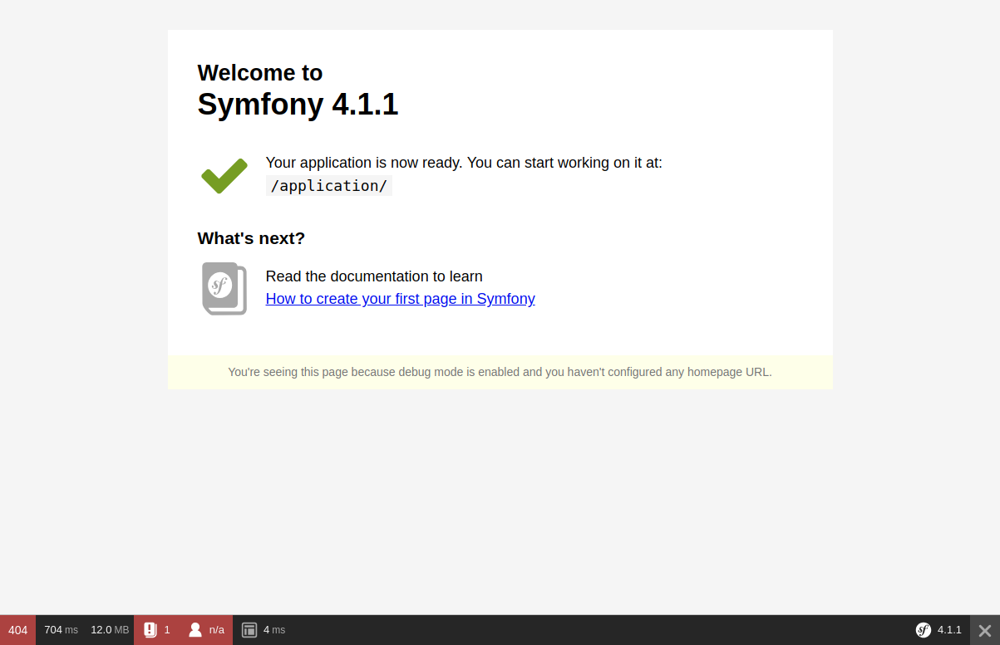

# Jobeet Day 1: Starting up the Project

Today we will setup the development environment, install Symfony 4.1 and display a page of the application in the web browser.
First of all, we need to have a friendly working environment for web development. We will use [Docker][1] with 
nginx and PHP images from [Docker Hub][2].
To check the minimum requirements for running Symfony 4.1 you can access this [link][3].

## Docker configuration
After you install [Docker][4] and [Docker Compose][5], create a new folder named `jobeet`, copy the [archive](../files/archives/jobeet.zip) into the folder and decompress it.
It is initial configuration for generic PHP project, which was generated by service [phpdocker.io][9].
It includes PHP 7.2, MySQL 5.7 and nginx. To start containers just run next command:

```bash
docker-compose up -d
```

What we did here:

* we called `docker-compose` that wraps the functionality of Docker and does working with Docker easier
* this command reads configuration from `docker-compose.yml` from folder where command is run
* `up` means start and run our entire application
* `-d` means detached mode. Command will run containers in the background and console will be free to use for next commands.

After several minutes containers will be running and you can check it with next command:

```bash
docker-compose ps
```

The result should be the same:

```bash
      Name                   Command             State           Ports          
-------------------------------------------------------------------------------
jobeet-mysql       docker-entrypoint.sh mysqld   Up      0.0.0.0:3306->3306/tcp 
jobeet-php-fpm     /bin/sh -c /usr/bin/php-fpm   Up      9000/tcp               
jobeet-webserver   nginx -g daemon off;          Up      0.0.0.0:80->80/tcp
```

Congratulations! Now you have prepared environment for Jobeet project.

## Download and install Symfony 4.1

To create our Symfony project we will use method described in official [documentation][6].
First of all, enter PHP container:

```bash
docker-compose exec php-fpm bash
```

* `exec` command is used to run commands in container
* `php-fpm` is the name of the container (line 27 in `docker-compose.yml` file)
* `bash` executes bash in the container

Now you are in php container. Run `php -v` to check that php exists and the version is `7.2.x`.

After that create Symfony project in `tmp` _(temporary)_ folder, copy it to your project folder, exit from container and change permission of files to be able to edit them from your IDE:

```bash
composer create-project symfony/website-skeleton:4.1 /tmp/jobeet/
cp -aR /tmp/jobeet/. .
exit;
sudo chown -R $USER:$USER .
```

We install into `tmp` directory and copy then to proper one, because `create-project` command requires target folder to be empty, but in project’s folder we already have docker files.

## Test the Symfony installation

Now open your web browser and enter the [http://127.0.0.1][7] URL. You should see error `No route found for "GET /"` but it’s OK. You don’t have any routes created yet.

## Symfony console

Symfony 4 comes with the console component tool that you will use for different tasks. To see a list of things it can do for you type at the command prompt:

```bash
bin/console list
```

> Note: don’t forget first to enter in PHP container if you are not in: `docker-compose exec php-fpm bash`
> and to execute this command from PHP container

## The Environments

Symfony 4 has different environments. If you look in the project’s directory, you will see file `.env` with variable `APP_ENV=dev` inside.
Value `prod` stands for production environment and `dev` is used by web developers when they work on the application in the development environment.  

The development environment will prove very handy because it will show you all the errors and warnings and the Web Debug Toolbar  —  the developer’s best friend.
Check the development environment by accessing [http://127.0.0.1][7] in your browser (note the bottom debug toolbar).



That’s all for today. You can find the code from this day here: [https://github.com/gregurco/jobeet/tree/day1][8].
See you on the next day of this tutorial where we will talk about what exactly the Jobeet site will be about!

## Additional information

- [Installing & Setting up the Symfony Framework][10]
- [What is Docker][11]
- [Overview of Docker Compose][12]

## Next Steps

Continue this tutorial here: [Jobeet Day 2: The Project](day-2.md)

Main page is available here: [Symfony 4.1 Jobeet Tutorial](../index.md)

[1]: https://www.docker.com/
[2]: https://hub.docker.com/
[3]: https://symfony.com/doc/4.1/reference/requirements.html
[4]: https://docs.docker.com/install/linux/docker-ce/ubuntu/
[5]: https://docs.docker.com/compose/install/
[6]: https://symfony.com/doc/4.1/setup.html
[7]: http://127.0.0.1
[8]: https://github.com/gregurco/jobeet/tree/day1
[9]: https://phpdocker.io/generator
[10]: https://symfony.com/doc/4.1/setup.html
[11]: https://www.docker.com/what-docker
[12]: https://docs.docker.com/compose/overview/
