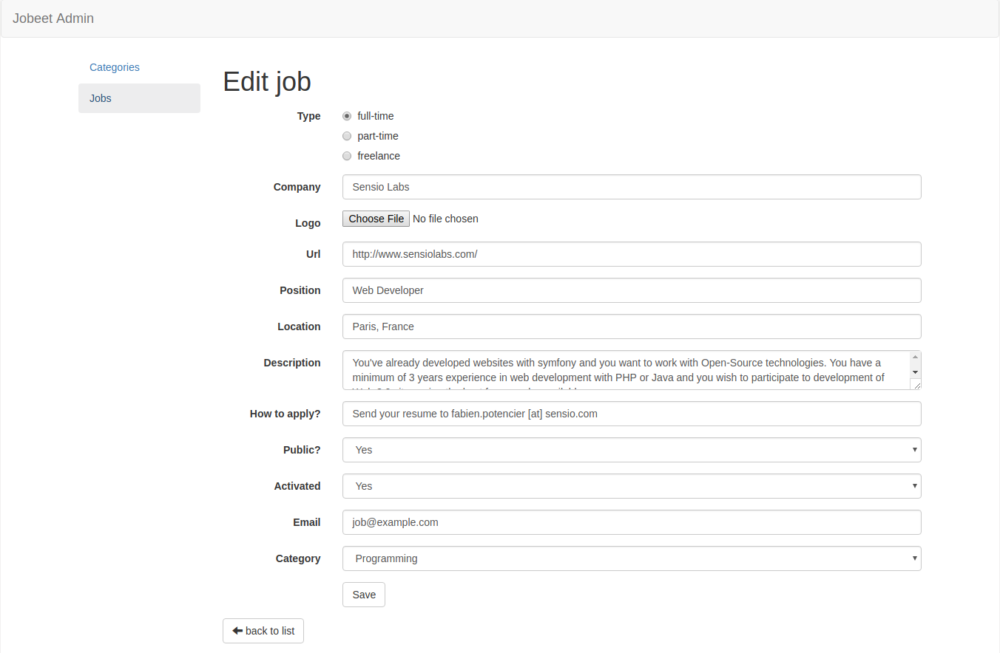
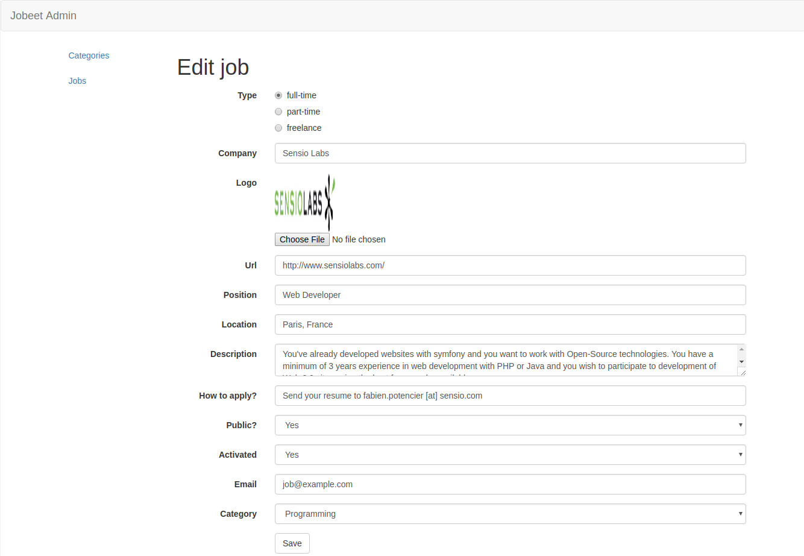

# Jobeet Day 10: The Admin

With the addition we made in day 9 on Jobeet, the frontend application is now fully useable by job seekers and job posters. It’s time to talk a bit about the backend application.  
Today we will develop a complete backend interface for Jobeet in just one day.

## Main concept

The Admin part is another side of Jobeet application and this side includes functionality that is not available in frontend application, for example: creation and deletion of categories.  
For security and architectural reasons this logic should be **separated** from frontend application. Let’s keep in mind this idea during all this day.

## First admin controller

We have to create our first admin controller and we know that this controller should be separated from existing ones.  
Create new folder `src/Controller/Admin` with new file `CategoryController.php`:

```php
namespace App\Controller\Admin;

use Symfony\Bundle\FrameworkBundle\Controller\AbstractController;

class CategoryController extends AbstractController
{

}
```

All admin controllers will be created in this folder.

## Admin templates layout

We will create admin templates and all of them will extend some layout, like we did with all out templates:

```twig


{# page content #}
```

But we can’t use this one, because admin layout have some differences:
- left menu with links to all CRUDs
- button from top menu will redirect to admin default CRUD and not to jobeet main page
- *and probably many other things will differ with time.*

Also like we did with controllers, we will keep admin templates separately in folder `/templates/admin`.
Let’s create admin templates layout `base.html.twig`:

```twig
<!DOCTYPE html>
<html>
<head>
    <title>Jobeet - Admin</title>

    <meta http-equiv="Content-Type" content="text/html; charset=utf-8"/>

    

    

    <link rel="stylesheet" href="https://maxcdn.bootstrapcdn.com/bootstrap/3.3.7/css/bootstrap.min.css">
</head>
<body>
<nav class="navbar navbar-default">
    <div class="container-fluid">
        <div class="navbar-header">
            <a class="navbar-brand" href="#">Jobeet Admin</a>
        </div>
    </div>
</nav>

<div class="container">
    <div class="row">
        <div class="col-md-2">
            <ul class="nav nav-pills nav-stacked nav-pills-stacked-example">
                <li role="presentation">
                    <a href="#">Categories</a>
                </li>

                <li role="presentation">
                    <a href="#">Jobs</a>
                </li>
            </ul>
        </div>

        <div class="col-md-10">
            
        </div>
    </div>
</div>
</body>
</html>
```

Now it’s pretty similar with one we have, but it gives us possibility to change it without affecting public pages.

## Category CRUD

### List action

We have controller and layout, now let’s start creating CRUD from list action:

```php
namespace App\Controller\Admin;

use App\Entity\Category;
use Doctrine\ORM\EntityManagerInterface;
use Symfony\Bundle\FrameworkBundle\Controller\AbstractController;
use Symfony\Component\Routing\Annotation\Route;
use Symfony\Component\HttpFoundation\Response;

class CategoryController extends AbstractController
{
    /**
     * Lists all categories entities.
     *
     * @Route("/admin/categories", name="admin.category.list", methods="GET")
     *
     * @param EntityManagerInterface $em
     *
     * @return Response
     */
    public function list(EntityManagerInterface $em) : Response
    {
        $categories = $em->getRepository(Category::class)->findAll();

        return $this->render('admin/category/list.html.twig', [
            'categories' => $categories,
        ]);
    }
}
```

It’s very simple and small: we get all categories from database and pass them to template.
Just pay attention to route: path starts with `/admin/` and name starts with `admin.`. It will help us to keep admin routes grouped.  

Now create a template `admin/category/list.html.twig` where all the categories will be shown:

```twig



    <table class="table">
        <thead>
        <tr class="active">
            <th>Name</th>
            <th>Position</th>
            <th>Jobs</th>
            <th>Affiliates</th>
            <th>Actions</th>
        </tr>
        </thead>

        <tbody>
        
            <tr>
                <td>{{ category.name }}</td>
                <td>{{ category.slug }}</td>
                <td>{{ category.jobs.count }}</td>
                <td>{{ category.affiliates.count }}</td>
                <td>
                    <ul class="list-inline">
                        <li>
                            <a href="#" class="btn btn-default">Edit</a>
                        </li>

                        <li>
                            <a href="#" class="btn btn-danger">Delete</a>
                        </li>
                    </ul>
                </td>
            </tr>
        
        </tbody>
    </table>

    <a href="#" class="btn btn-success">Create new</a>

```

### Create action

For create action first of all we have to create form. Forms that are strictly related to admin will be placed in separate folder too.  
Create `CategoryType` class in `/src/Form/Admin` folder:

```php
namespace App\Form\Admin;

use App\Entity\Category;
use Symfony\Component\Form\AbstractType;
use Symfony\Component\Form\Extension\Core\Type\TextType;
use Symfony\Component\Form\FormBuilderInterface;
use Symfony\Component\OptionsResolver\OptionsResolver;
use Symfony\Component\Validator\Constraints\Length;
use Symfony\Component\Validator\Constraints\NotBlank;

class CategoryType extends AbstractType
{
    /**
     * @param FormBuilderInterface $builder
     * @param array $options
     */
    public function buildForm(FormBuilderInterface $builder, array $options)
    {
        $builder->add('name', TextType::class, [
            'constraints' => [
                new NotBlank(),
                new Length(['max' => 100]),
            ]
        ]);
    }

    /**
     * @param OptionsResolver $resolver
     */
    public function configureOptions(OptionsResolver $resolver)
    {
        $resolver->setDefaults([
            'data_class' => Category::class,
        ]);
    }
}
```

It’s very simple form with only one field and some basic validation rules.
Just notice that `slug` is generated automatically and we don’t have to provide it.

The next step is to create action in controller and to build form:

```php
// ...
use App\Form\Admin\CategoryType;
use Symfony\Component\HttpFoundation\Request;

class CategoryController extends AbstractController
{
    // ...

    /**
     * Create category.
     *
     * @Route("/admin/category/create", name="admin.category.create", methods="GET|POST")
     *
     * @param Request $request
     * @param EntityManagerInterface $em
     *
     * @return Response
     */
    public function create(Request $request, EntityManagerInterface $em) : Response
    {
        $category = new Category();
        $form = $this->createForm(CategoryType::class, $category);

        return $this->render('admin/category/create.html.twig', [
            'form' => $form->createView(),
        ]);
    }
}
```

Now create template `admin/category/create.html.twig` and render the form:

```twig



    <h1>Create new category</h1>
    
    {{ form_start(form, {'attr': {'novalidate': 'novalidate'}}) }}
        {{ form_widget(form) }}
    
        <div class="form-group">
            <div class="col-sm-offset-2 col-sm-10">
                <button type="submit" class="btn btn-default">Save</button>
            </div>
        </div>
    {{ form_end(form) }}
    
    <a href="{{ path('admin.category.list') }}" class="btn btn-default">
        <span class="glyphicon glyphicon-arrow-left" aria-hidden="true"></span>
        back to list
    </a>

```

Link the "Create new" button from list page with create page in `templates/admin/category/list.html.twig`:

```diff
- <a href="#" class="btn btn-success">Create new</a>
+ <a href="{{ path('admin.category.create') }}" class="btn btn-success">Create new</a>
```

Page is accessible and form is displayed, but not handled.  
Add handling of form in `create` action:

```php
// ...

class CategoryController extends AbstractController
{
    // ...
    public function create(Request $request, EntityManagerInterface $em) : Response
    {
        $category = new Category();
        $form = $this->createForm(CategoryType::class, $category);

        if ($form->isSubmitted() && $form->isValid()) {
            $em->persist($category);
            $em->flush();

            return $this->redirectToRoute('admin.category.list');
        }

        return $this->render('admin/category/create.html.twig', [
            'form' => $form->createView(),
        ]);
    }
}
```

That’s it. Now admin can create as much categories as wants.

### Edit action

In edit action we can use the same form, so let’s move on to creating a method in controller:

```php
// ...

class CategoryController extends AbstractController
{
    // ...

    /**
     * Edit category.
     *
     * @Route("/admin/category/{id}/edit", name="admin.category.edit", methods="GET|POST", requirements={"id" = "\d+"})
     *
     * @param Request $request
     * @param EntityManagerInterface $em
     * @param Category $category
     *
     * @return Response
     */
    public function edit(Request $request, EntityManagerInterface $em, Category $category) : Response
    {
        $form = $this->createForm(CategoryType::class, $category);
        $form->handleRequest($request);

        if ($form->isSubmitted() && $form->isValid()) {
            $em->flush();

            return $this->redirectToRoute('admin.category.list');
        }

        return $this->render('admin/category/edit.html.twig', [
            'category' => $category,
            'form' => $form->createView(),
        ]);
    }
}
```

and template `templates/admin/category/edit.html.twig`:

```twig



    <h1>Edit category "{{ category.name }}"</h1>

    {{ form_start(form, {'attr': {'novalidate': 'novalidate'}}) }}
        {{ form_widget(form) }}
    
        <div class="form-group">
            <div class="col-sm-offset-2 col-sm-10">
                <button type="submit" class="btn btn-default">Save</button>
            </div>
        </div>
    {{ form_end(form) }}

    <a href="{{ path('admin.category.list') }}" class="btn btn-default">
        <span class="glyphicon glyphicon-arrow-left" aria-hidden="true"></span>
        back to list
    </a>

```

change link to the edit page in `list.html.twig`:

```diff
- <a href="#" class="btn btn-default">Edit</a>
+ <a href="{{ path('admin.category.edit', {id: category.id}) }}" class="btn btn-default">Edit</a>
```

The editing of categories works now and slug is automatically changed but the rendering of form is same in create and edit template.
Move it to separate template `templates/admin/category/_form.html.twig`:

```twig
{{ form_start(form, {'attr': {'novalidate': 'novalidate'}}) }}
    {{ form_widget(form) }}

    <div class="form-group">
        <div class="col-sm-offset-2 col-sm-10">
            <button type="submit" class="btn btn-default">Save</button>
        </div>
    </div>
{{ form_end(form) }}
```

and include in both places:

```twig

```

### Delete action

Sometimes it’s no need to create separate form type class, but we have to perform POST|PUT|DELETE action.  
In this case we can write the form directly in template, but not to lose [CSRF][2] protection we can use [csrf_token][3] function.
Let’s add the form in `templates/admin/category/list.html.twig` template:

```twig
{# ... #}


    <tr>
        <td>{{ category.name }}</td>
        <td>{{ category.slug }}</td>
        <td>{{ category.jobs.count }}</td>
        <td>{{ category.affiliates.count }}</td>
        <td>
            <ul class="list-inline">
                <li>
                    <a href="{{ path('admin.category.edit', {id: category.id}) }}" class="btn btn-default">Edit</a>
                </li>

                <li>
                    <form method="post" action="{{ path('admin.category.delete', {id: category.id}) }}" onsubmit="return confirm('Are you sure you want to delete this item?');">
                        <input type="hidden" name="_method" value="DELETE">
                        <input type="hidden" name="_token" value="{{ csrf_token('delete' ~ category.id) }}">
                        <button class="btn btn-danger">Delete</button>
                    </form>
                </li>
            </ul>
        </td>
    </tr>

        
{# ... #}
```

create the action in controller:

```php
// ...

class CategoryController extends AbstractController
{
    // ...

    /**
     * Delete category.
     *
     * @Route("/admin/category/{id}/delete", name="admin.category.delete", methods="DELETE", requirements={"id" = "\d+"})
     *
     * @param Request $request
     * @param EntityManagerInterface $em
     * @param Category $category
     *
     * @return Response
     */
    public function delete(Request $request, EntityManagerInterface $em, Category $category) : Response
    {

    }
}
```

validate CSRF token and delete the category:

```php
// ...

class CategoryController extends AbstractController
{
    // ...

    /**
     * Delete category.
     *
     * @Route("/admin/category/{id}/delete", name="admin.category.delete", methods="DELETE", requirements={"id" = "\d+"})
     *
     * @param Request $request
     * @param EntityManagerInterface $em
     * @param Category $category
     *
     * @return Response
     */
    public function delete(Request $request, EntityManagerInterface $em, Category $category) : Response
    {
        if ($this->isCsrfTokenValid('delete' . $category->getId(), $request->request->get('_token'))) {
            $em->remove($category);
            $em->flush();
        }

        return $this->redirectToRoute('admin.category.list');
    }
}
```

The shortcut method `isCsrfTokenValid` was added in [Symfony 2.6][4] and helps us to validate the token manually.  

It should work good, but the error will be thrown in case category has related jobs.
It’s because doctrine doesn’t know what to do with relation: to remove jobs or to set NULL in `category_id` and default behavior is simply to restrict.  
If we want to allow cascade delete, then we have to modify `src/Entity/Category.php`:

```diff
 /**
  * @var Job[]|ArrayCollection
  *
- * @ORM\OneToMany(targetEntity="Job", mappedBy="category")
+ * @ORM\OneToMany(targetEntity="Job", mappedBy="category", cascade={"remove"})
  */
 private $jobs;
```

Note: no migration needed here.

## Job CRUD

Admin should have the same CRUD for jobs and we will do it in the same way as previous CRUD, but with one small difference: we plan to have posted many jobs and we should think about pagination.  
Let’s introduce one more variable in `config/services.yaml`, but for this time this variable will be more generic and we will be able to use it anywhere:

```twig
parameters:
    # ...
    max_per_page: 10
```

### List action

Create `JobController` in the same folder as `CategoryController`:

```php
namespace App\Controller\Admin;

use Symfony\Bundle\FrameworkBundle\Controller\AbstractController;

class JobController extends AbstractController
{

}
```

and add list action:

```php
namespace App\Controller\Admin;

use App\Entity\Job;
use Doctrine\ORM\EntityManagerInterface;
use Knp\Component\Pager\PaginatorInterface;
use Symfony\Bundle\FrameworkBundle\Controller\AbstractController;
use Symfony\Component\Routing\Annotation\Route;
use Symfony\Component\HttpFoundation\Response;

class JobController extends AbstractController
{
    /**
     * Lists all jobs entities.
     *
     * @Route("/admin/jobs/{page}",
     *     name="admin.job.list",
     *     methods="GET",
     *     defaults={"page": 1},
     *     requirements={"page" = "\d+"}
     * )
     *
     * @param EntityManagerInterface $em
     * @param PaginatorInterface $paginator
     * @param int $page
     *
     * @return Response
     */
    public function list(EntityManagerInterface $em, PaginatorInterface $paginator, int $page) : Response
    {
        $jobs = $paginator->paginate(
            $em->getRepository(Job::class)->createQueryBuilder('j'),
            $page,
            $this->getParameter('max_per_page'),
            [
                PaginatorInterface::DEFAULT_SORT_FIELD_NAME => 'j.createdAt',
                PaginatorInterface::DEFAULT_SORT_DIRECTION => 'DESC',
            ]
        );

        return $this->render('admin/job/list.html.twig', [
            'jobs' => $jobs,
        ]);
    }
}
```

We used `max_per_page` variable for pagination limit and additional options in method `paginate` in order to change sorting of elements.
Admin will see new jobs on first page.

Now create template `templates/admin/job/list.html.twig`:

```twig



    <table class="table">
        <thead>
        <tr class="active">
            <th>Company</th>
            <th>Position</th>
            <th>Location</th>
            <th>Email</th>
            <th>URL</th>
            <th>Activated</th>
            <th>Actions</th>
        </tr>
        </thead>

        <tbody>
        
            <tr>
                <td>{{ job.company }}</td>
                <td>{{ job.position }}</td>
                <td>{{ job.location }}</td>
                <td>{{ job.email }}</td>
                <td>{{ job.url }}</td>
                <td>
                    
                        <span class="glyphicon glyphicon-ok" aria-hidden="true"></span>
                    
                        <span class="glyphicon glyphicon-remove" aria-hidden="true"></span>
                    
                </td>
                <td class="text-nowrap">
                    <ul class="list-inline">
                        <li>
                            <a href="#" class="btn btn-default">Edit</a>
                        </li>

                        <li>
                            <a href="#" class="btn btn-danger">Delete</a>
                        </li>
                    </ul>
                </td>
            </tr>
        
        </tbody>
    </table>

    <div class="navigation text-center">
        {{ knp_pagination_render(jobs) }}
    </div>

    <a href="#" class="btn btn-success">Create new</a>

```

Fix the link in left menu, to be able to access this page:

```diff
# templates/admin/base.html.twig

- <a href="#">Jobs</a>
+ <a href="{{ path('admin.job.list') }}">Jobs</a>
```

The list of jobs is shown!

### Create action

Create action for job is pretty similar with create action for categories, but with one small exception: we already have form type class and we gonna use it:

```php
// ...
use App\Form\JobType;
use Symfony\Component\HttpFoundation\Request;

class JobController extends AbstractController
{
    // ...

    /**
     * Create job.
     *
     * @Route("/admin/job/create", name="admin.job.create", methods="GET|POST")
     *
     * @param Request $request
     * @param EntityManagerInterface $em
     *
     * @return Response
     */
    public function create(Request $request, EntityManagerInterface $em) : Response
    {
        $job = new Job();
        $form = $this->createForm(JobType::class, $job);
        $form->handleRequest($request);

        if ($form->isSubmitted() && $form->isValid()) {
            $em->persist($job);
            $em->flush();

            return $this->redirectToRoute('admin.job.list');
        }

        return $this->render('admin/job/create.html.twig', [
            'form' => $form->createView(),
        ]);
    }
}
```

Link the button from list page with this new action:

```diff
# templates/admin/job/list.html.twig

- <a href="#" class="btn btn-success">Create new</a>
+ <a href="{{ path('admin.job.create') }}" class="btn btn-success">Create new</a>
```

Create template `templates/admin/job/create.html.twig` and let’s move the form to separate file from the beginning, because we know, that the same rendering will be in the edit action:

```twig



    <h1>Create new job</h1>

    

    <a href="{{ path('admin.job.list') }}" class="btn btn-default">
        <span class="glyphicon glyphicon-arrow-left" aria-hidden="true"></span>
        back to list
    </a>

```

Form rendering in `templates/admin/job/_form.html.twig`:

```twig
{{ form_start(form, {'attr': {'novalidate': 'novalidate'}}) }}
    {{ form_widget(form) }}

    <div class="form-group">
        <div class="col-sm-offset-2 col-sm-10">
            <button type="submit" class="btn btn-default">Save</button>
        </div>
    </div>
{{ form_end(form) }}
```

Now admin is able to create jobs directly from admin panel!

### Edit action

For edit action we have to add action in controller:

```php
// ...

class JobController extends AbstractController
{
    // ...

    /**
     * Edit job.
     *
     * @Route("/admin/job/{id}/edit", name="admin.job.edit", methods="GET|POST", requirements={"id" = "\d+"})
     *
     * @param Request $request
     * @param EntityManagerInterface $em
     * @param Job $job
     *
     * @return Response
     */
    public function edit(Request $request, EntityManagerInterface $em, Job $job) : Response
    {
        $form = $this->createForm(JobType::class, $job);
        $form->handleRequest($request);

        if ($form->isSubmitted() && $form->isValid()) {
            $em->flush();

            return $this->redirectToRoute('admin.job.list');
        }

        return $this->render('admin/job/edit.html.twig', [
            'form' => $form->createView(),
        ]);
    }
}
```

> Note: don’t forget about method and parameters restriction.

After that connect the link from list page with edit action:

```diff
- <a href="#" class="btn btn-default">Edit</a>
+ <a href="{{ path('admin.job.edit', {id: job.id}) }}" class="btn btn-default">Edit</a>
```

And now create template `admin/job/edit.html.twig`:

```twig



    <h1>Edit job</h1>

    

    <a href="{{ path('admin.job.list') }}" class="btn btn-default">
        <span class="glyphicon glyphicon-arrow-left" aria-hidden="true"></span>
        back to list
    </a>

```

### Improve edit form

In the edit form we have one specific field: **logo**. Try to open edit form for job with logo:



Did you notice that it’s impossible to know if there is a logo without looking into database.
Let’s show the logo image above logo field.

Symfony gives us possibility to customize rendering of any parts of form. Open `templates/admin/job/edit.html.twig` and add next code between `extend` and `body` block:
```twig



    
        
    

    {{ form_widget(form) }}

```

By using the special `` tag, Twig looks inside the same template for any overridden form blocks.
But with tag `` we override rendering of `logo` field for `job` form.  
It’s important to note that variable `form` inside of block `_job_logo_widget` represents not the whole form, but the `logo` field and in `form.vars` we can find a lot of useful information, like in `form.vars.data` we have the value of logo field (same as to call `$job->getLogo()`).  
Tag `{{ form_widget(form) }}` renders the file input, like it was before.  
Now form looks more informative:



> Why did we override field in `edit.html.twig` file and not in `_form.html.twig`?
> In a template which does not extend a parent *(in our case `_form.html.twig` is just included)*, a  tag does 2 things:
> - it defines a block  
> - it renders this block right where it was defined

### Delete action

Create a method in `JobController` to add the delete functionality:

```php
// ...

class JobController extends AbstractController
{
    // ...
    
    /**
     * Delete category.
     *
     * @Route("/admin/category/{id}/delete", name="admin.category.delete", methods="DELETE", requirements={"id" = "\d+"})
     *
     * @param Request $request
     * @param EntityManagerInterface $em
     * @param Category $category
     *
     * @return Response
     */
    public function delete(Request $request, EntityManagerInterface $em, Category $category) : Response
    {
        if ($this->isCsrfTokenValid('delete' . $category->getId(), $request->request->get('_token'))) {
            $em->remove($category);
            $em->flush();
        }

        return $this->redirectToRoute('admin.category.list');
    }
}
```

Add a form in list action:

```twig
{# ... #}


    <tr>
        <td>{{ job.company }}</td>
        <td>{{ job.position }}</td>
        <td>{{ job.location }}</td>
        <td>{{ job.email }}</td>
        <td>{{ job.url }}</td>
        <td>
            
                <span class="glyphicon glyphicon-ok" aria-hidden="true"></span>
            
                <span class="glyphicon glyphicon-remove" aria-hidden="true"></span>
            
        </td>
        <td class="text-nowrap">
            <ul class="list-inline">
                <li>
                    <a href="{{ path('admin.job.edit', {id: job.id}) }}" class="btn btn-default">Edit</a>
                </li>

                <li>
                    <form method="post" action="{{ path('admin.job.delete', {id: job.id}) }}" onsubmit="return confirm('Are you sure you want to delete this item?');">
                        <input type="hidden" name="_method" value="DELETE">
                        <input type="hidden" name="_token" value="{{ csrf_token('delete' ~ job.id) }}">
                        <button class="btn btn-danger">Delete</button>
                    </form>
                </li>
            </ul>
        </td>
    </tr>

        
{# ... #}
```

Now admin is able to delete jobs.

## Improve left menu

How can we activate items in left menu? Just track name of current route.
For example, if it starts with `admin.category.` then category item should be active.
In Twig we have global variable `app` with property `request`, where current request is stored. Let’s use it active menu items:

```twig
{# ... #}

<div class="col-md-2">
    

    <ul class="nav nav-pills nav-stacked nav-pills-stacked-example">
        <li role="presentation" class="active">
            <a href="{{ path('admin.category.list') }}">Categories</a>
        </li>

        <li role="presentation" class="active">
            <a href="{{ path('admin.job.list') }}">Jobs</a>
        </li>
    </ul>
</div>

{# ... #}
```

`starts with` is build-in functionality and helps to track if string starts with another string.

## Conclusion

We spent not so many time and implemented CRUDs for all the functionality we have on front side, but there is another option - to use bundles that provide admin functionality:
- [EasyAdminBundle][7]
- [SonataAdminBundle][8]
- [and many others][9]

These bundles are easy configurable and it’s easy to start with them, but you will not have the same flexibility as in case you create all CRUDs manually.  
The choice is yours!

That’s all for today, you can find the code here: [https://github.com/gregurco/jobeet/tree/day10][10]

See you tomorrow!

## Additional information
- [The Symfony MakerBundle][1]
- [CSRF][5]
- [Working with Associations: Transitive persistence / Cascade Operations][6]
- [EasyAdminBundle][7]
- [SonataAdminBundle][8]
- [How to Customize Form Rendering][11]

## Next Steps

Continue this tutorial here: [Jobeet Day 11: The User](day-11.md)

Previous post is available here: [Jobeet Day 9: Console Commands](day-9.md)

Main page is available here: [Symfony 4.1 Jobeet Tutorial](../index.md)

[1]: https://symfony.com/doc/1.0/bundles/SymfonyMakerBundle/index.html
[2]: https://en.wikipedia.org/wiki/Cross-site_request_forgery
[3]: https://symfony.com/doc/4.1/reference/twig_reference.html#csrf-token
[4]: https://symfony.com/blog/new-in-symfony-2-6-new-shortcut-methods-for-controllers
[5]: https://symfony.com/doc/4.1/security/csrf.html
[6]: https://doctrine-project.org/projects/doctrine-orm/en/2.6/reference/working-with-associations.html#transitive-persistence-cascade-operations
[7]: https://symfony.com/doc/master/bundles/EasyAdminBundle/index.html
[8]: https://symfony.com/doc/master/bundles/SonataAdminBundle/index.html
[9]: https://packagist.org/?query=admin%20bundle&tags=symfony
[10]: https://github.com/gregurco/jobeet/tree/day10
[11]: https://symfony.com/doc/4.1/form/form_customization.html
