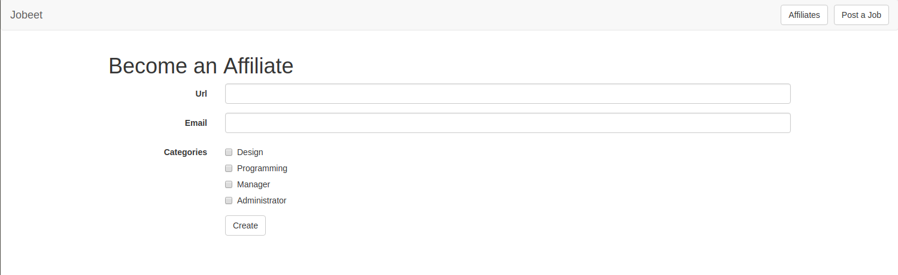
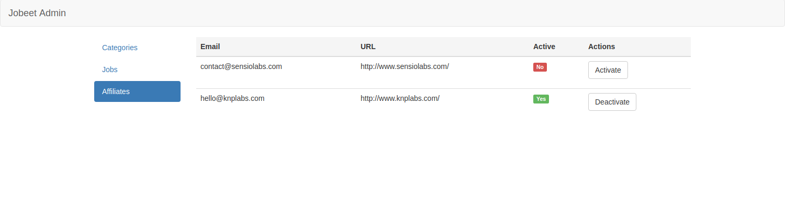

# Jobeet Day 12: The API

When you post a job, you will want to have the greatest exposure possible.
If your job is syndicated on a lot of small sites, you will have a better chance to find the right person. That’s the power of the [long tail][1].
Affiliates will be able to publish the latest posted jobs on their sites thanks to the API we will develop along this day.

## Affiliates

As per [day 2](day-2.md) requirements:

> "Story F7: An affiliate retrieves the current active job list"

### The Fixtures

> Note! There was a change in day 3: in file `src/Entity/Affiliate.php` method `setCategories` was replaced by two methods
> `addCategory` and `removeCategory`. Please check if you have these methods in Affiliate class and compare it with file from [day 3](day-3.md).

Let’s create a new fixture file for the affiliates:

```php
namespace App\DataFixtures;

use App\Entity\Affiliate;
use Doctrine\Bundle\FixturesBundle\Fixture;
use Doctrine\Common\DataFixtures\DependentFixtureInterface;
use Doctrine\Common\Persistence\ObjectManager;

class AffiliateFixtures extends Fixture implements DependentFixtureInterface
{
    /**
     * @param ObjectManager $manager
     *
     * @return void
     */
    public function load(ObjectManager $manager) : void
    {
        $affiliateSensioLabs = new Affiliate();
        $affiliateSensioLabs->setUrl('http://www.sensiolabs.com/');
        $affiliateSensioLabs->setEmail('contact@sensiolabs.com');
        $affiliateSensioLabs->setActive(true);
        $affiliateSensioLabs->setToken('sensio_labs');
        $affiliateSensioLabs->addCategory($manager->merge($this->getReference('category-programming')));

        $affiliateKNPLabs = new Affiliate();
        $affiliateKNPLabs->setUrl('http://www.knplabs.com/');
        $affiliateKNPLabs->setEmail('hello@knplabs.com');
        $affiliateKNPLabs->setActive(true);
        $affiliateKNPLabs->setToken('knp_labs');
        $affiliateKNPLabs->addCategory($manager->merge($this->getReference('category-programming')));
        $affiliateKNPLabs->addCategory($manager->merge($this->getReference('category-design')));

        $manager->persist($affiliateSensioLabs);
        $manager->persist($affiliateKNPLabs);

        $manager->flush();
    }

    /**
     * @return array
     */
    public function getDependencies(): array
    {
        return [
            CategoryFixtures::class,
        ];
    }
}
```

In the fixtures file, tokens are hardcoded to simplify the testing, but when an actual user applies for an account, the token will need to be generated.
Create a new listener in `src/EventListener` folder:

```php
namespace App\EventListener;

use App\Entity\Affiliate;
use Doctrine\ORM\Event\LifecycleEventArgs;

class AffiliateTokenListener
{
    /**
     * @param LifecycleEventArgs $args
     */
    public function prePersist(LifecycleEventArgs $args)
    {
        $entity = $args->getEntity();

        if (!$entity instanceof Affiliate) {
            return;
        }

        if (!$entity->getToken()) {
            $entity->setToken(\bin2hex(\random_bytes(10)));
        }
    }
}
```

Register this listener in `config/services.yaml`:

```yaml
# ...

services:
    # ...
    
    App\EventListener\AffiliateTokenListener:
        tags:
            - { name: doctrine.event_listener, event: prePersist }
```

Now you can reload fixtures:

```bash
bin/console doctrine:fixtures:load
```

## The Job API

### Setup bundles

To create the job API we gonna use bunch of two bundles: [JMSSerializerBundle][3] and [FOSRestBundle][2].
**JMSSerializerBundle** is used to easily serialize and deserialize data, and **FOSRestBundle** provides various tools to rapidly develop RESTful API’s.

First install [JMSSerializerBundle][3]:

```bash
composer require jms/serializer-bundle ^3.1
```

During the installation you will be asked if recipe from **contrib** repository should be applied:


Our suggestion is to answer `y` *(Yes)*.  
Thanks to Symfony Flex and this recipe bundle will be automatically connected in `config/bundles.php` and next configuration files will be created:

* `config/packages/dev/jms_serializer.yaml`
* `config/packages/jms_serializer.yaml`

Next install [FOSRestBundle][2]:

```bash
composer require friendsofsymfony/rest-bundle ^2.5
```

There will be the same question and after that new config file will appear: `config/packages/fos_rest.yaml`.  
We have bundles installed and initial configuration created!

### Create Controller

It is good practice to separate API routes and controllers as we did with admin routes:

* all controllers will be placed in `src/Controller/API`
* all routes will start with `/api/v1/`


Create first API controller in folder `src/Controller/API`:

```php
namespace App\Controller\API;

use FOS\RestBundle\Controller\FOSRestController;

class JobController extends FOSRestController
{

}
```

Notice that this controller extends `FOSRestController` class from `FOSRestBundle` package.
This parent controller provides some helper methods that we will use.

And modify `config/routes/annotations.yaml`:

```diff
  controllers:
      resource: ../../src/Controller/
      type: annotation
  
+ api_controllers:
+     resource: ../../src/Controller/API/
+     type: annotation
+     prefix: /api/v1/
```

This change prepend `/api/v1/` to all routes from `src/Controller/API/` folder and we don’t have to track it for each API route.

Routes configuration is done and let’s create our first action:

```php
namespace App\Controller\API;

use App\Entity\Affiliate;
use App\Entity\Job;
use Doctrine\ORM\EntityManagerInterface;
use FOS\RestBundle\Controller\FOSRestController;
use FOS\RestBundle\Controller\Annotations as Rest;
use Symfony\Component\HttpFoundation\Response;

class JobController extends FOSRestController
{
    /**
     * @Rest\Get("/{token}/jobs", name="api.job.list")
     *
     * @param Affiliate $affiliate
     * @param EntityManagerInterface $em
     *
     * @return Response
     */
    public function getJobsAction(Affiliate $affiliate, EntityManagerInterface $em) : Response
    {
        $jobs = $em->getRepository(Job::class)->findActiveJobs();

        return $this->handleView($this->view($jobs, Response::HTTP_OK));
    }
}
```

Do small adjustments in configuration file `config/packages/fos_rest.yaml` of the FOSRestBundle:

```yaml
fos_rest:
    format_listener:
        rules:
            - { path: ^/api, prefer_extension: true, fallback_format: json, priorities: [ json ] }
            - { path: ^/, prefer_extension: true, fallback_format: html,  priorities: [ html, '*/*'] }
```

Here we have two rules:

* rule for routes starting with `/api` - response will be serialized into json
* rule for all other routes - response will be formatted with twig, as it was before

It was the only thing you need to configure in FOSRestBundle.

Now try to open [http://127.0.0.1/api/v1/sensio_labs/jobs][4] link. You should see something similar:


> We use next extension for Chrome to beautify JSON output: [JSON Formatter][5].

What we did here:

* fetched affiliate by token from route (in our case token is `sensio_labs`)
* used `view` method to create `View` object with all jobs and 200 response code inside
* used `handleView` method to convert `View` object into response object

What is not done yet:

* check if affiliate is active
* return only jobs related to affiliate
* modify job serialization process

### Active affiliate

For now active and inactive affiliates are able to perform request and we have to fix it.  
The better place to put this logic is repository class. Create repository class in `src/Repository/AffiliateRepository.php` folder:

```php
namespace App\Repository;

use Doctrine\ORM\EntityRepository;

class AffiliateRepository extends EntityRepository
{

}
```

and link it in `Affiliate` entity:

```php
namespace App\Entity;

// ...

/**
 * @ORM\Entity(repositoryClass="App\Repository\AffiliateRepository")
 * ...
 */
class Affiliate
{
    // ...
}
```

add method in repository that will fetch active user by given token:

```php
namespace App\Repository;

use App\Entity\Affiliate;
use Doctrine\ORM\EntityRepository;

class AffiliateRepository extends EntityRepository
{
    /**
     * @param string $token
     *
     * @return Affiliate|null
     */
    public function findOneActiveByToken(string $token) : ?Affiliate
    {
        return $this->createQueryBuilder('a')
            ->where('a.active = :active')
            ->andWhere('a.token = :token')
            ->setParameter('active', true)
            ->setParameter('token', $token)
            ->getQuery()
            ->getOneOrNullResult();
    }
}
```

and adjust controller to use this method from repository:

```php
namespace App\Controller\API;

// ...
use Sensio\Bundle\FrameworkExtraBundle\Configuration\Entity;

class JobController extends FOSRestController
{
    /**
     * @Rest\Get("/{token}/jobs", name="api.job.list")
     *
     * @Entity("affiliate", expr="repository.findOneActiveByToken(token)")
     *
     * @param Affiliate $affiliate
     * @param EntityManagerInterface $em
     *
     * @return Response
     */
    public function getJobsAction(Affiliate $affiliate, EntityManagerInterface $em) : Response
    {
        // ...
    }
}
```

Try to modify `active` field in database and you will observe that inactive user are not allowed to perform requests.

### Jobs related to affiliate

If you noticed, we used `findActiveJobs` method to return active jobs. But what if affiliate is linked just to one category?  
Create another method in `JobRepository` that will get affiliate into consideration:

```php
namespace App\Repository;

// ...
use App\Entity\Affiliate;

class JobRepository extends EntityRepository
{
    // ...

    /**
     * @param Affiliate $affiliate
     *
     * @return Job[]
     */
    public function findActiveJobsForAffiliate(Affiliate $affiliate)
    {
        return $this->createQueryBuilder('j')
            ->leftJoin('j.category', 'c')
            ->leftJoin('c.affiliates', 'a')
            ->where('a.id = :affiliate')
            ->andWhere('j.expiresAt > :date')
            ->andWhere('j.activated = :activated')
            ->setParameter('affiliate', $affiliate)
            ->setParameter('date', new \DateTime())
            ->setParameter('activated', true)
            ->orderBy('j.expiresAt', 'DESC')
            ->getQuery()
            ->getResult();
    }
}
```

Here we joined jobs with categories and affiliates. The result includes **only** jobs that have relation with affiliate.

Call new method in controller:

```php

namespace App\Controller\API;

// ...

class JobController extends FOSRestController
{
    // ...
    public function getJobsAction(Affiliate $affiliate, EntityManagerInterface $em) : Response
    {
        $jobs = $em->getRepository(Job::class)->findActiveJobsForAffiliate($affiliate);

        return $this->handleView($this->view($jobs, Response::HTTP_OK));
    }
}
```

Insert some test data in `affiliates_categories` table and check the result.

### Serialization

If you look closely to the result, you will see that everything from the database is returned, including jobs and affiliates from the category of a job and that’s too much.
To limit the returned data we will use some methods from the **JMSSerializerBundle** we installed earlier.

Open the `src/Entity/Job.php` entity file and add the following annotations and new methods:

```php
// ...
use JMS\Serializer\Annotation as JMS;

/**
 * ...
 *
 * @JMS\ExclusionPolicy("all")
 */
class Job
{
    // ...

    /**
     * ...
     *
     * @JMS\Expose()
     * @JMS\Type("int")
     */
    private $id;

    /**
     * ...
     *
     * @JMS\Expose()
     * @JMS\Type("string")
     */
    private $type;

    /**
     * ...
     *
     * @JMS\Expose()
     * @JMS\Type("string")
     */
    private $company;

    /**
     * ...
     */
    private $logo;

    /**
     * ...
     *
     * @JMS\Expose()
     * @JMS\Type("string")
     */
    private $url;

    /**
     * ...
     *
     * @JMS\Expose()
     * @JMS\Type("string")
     */
    private $position;

    /**
     * ...
     *
     * @JMS\Expose()
     * @JMS\Type("string")
     */
    private $location;

    /**
     * ...
     *
     * @JMS\Expose()
     * @JMS\Type("string")
     */
    private $description;

    /**
     * ...
     *
     * @JMS\Expose()
     * @JMS\Type("string")
     */
    private $howToApply;

    /**
     * ...
     */
    private $token;

    /**
     * ...
     */
    private $public;

    /**
     * ...
     */
    private $activated;

    /**
     * ...
     */
    private $email;

    /**
     * ...
     *
     * @JMS\Expose()
     * @JMS\Type("DateTime")
     */
    private $expiresAt;

    /**
     * ...
     */
    private $createdAt;

    /**
     * ...
     */
    private $updatedAt;

    /**
     * ...
     */
    private $category;

    // ...

    /**
     * @JMS\VirtualProperty
     * @JMS\SerializedName("logo_path")
     *
     * @return string|null
     */
    public function getLogoPath()
    {
        return $this->getLogo() ? 'uploads/jobs/' . $this->getLogo() : null;
    }

    /**
     * @JMS\VirtualProperty
     * @JMS\SerializedName("category_name")
     *
     * @return string
     */
    public function getCategoryName()
    {
        return $this->getCategory()->getName();
    }
}
```

We added a couple of annotations that start with `@JMS`. All these annotations are provided by `JMSSerializerBundle`.  
The first one is: `@JMS\ExclusionPolicy("all")`. This annotations with value `all` tells to `JMSSerializerBundle` that all properties are excluded for serialization by default and only properties marked with `@JMS\Expose` will be serialized/unserialized.  
Also we added annotation `@JMS\Type` to all serialized properties. This annotation force a certain format to be used. The list of supported types can e found [here][6].

For computed properties, such as "logo_path" and "category_name", we added special set of annotations:
```
@JMS\VirtualProperty
@JMS\SerializedName
```

The first annotation indicates that the data returned by the method should appear like a property of the object.  
The second annotation is used to define the serialized name for the result.

You can read more about used annotation and others on the [JMSSerializerBundle documentation page][7].

## The Affiliate Application Form

Now that the web service is ready to be used, let’s create the account creation form for affiliates.

First create the controller:

```php
namespace App\Controller;

use Symfony\Bundle\FrameworkBundle\Controller\AbstractController;

class AffiliateController extends AbstractController
{

}
```

Next create form type that will be used in this controller:

```php
namespace App\Form;

use App\Entity\Affiliate;
use App\Entity\Category;
use Symfony\Bridge\Doctrine\Form\Type\EntityType;
use Symfony\Component\Form\AbstractType;
use Symfony\Component\Form\Extension\Core\Type\EmailType;
use Symfony\Component\Form\Extension\Core\Type\UrlType;
use Symfony\Component\Form\FormBuilderInterface;
use Symfony\Component\OptionsResolver\OptionsResolver;
use Symfony\Component\Validator\Constraints\Email;
use Symfony\Component\Validator\Constraints\Length;
use Symfony\Component\Validator\Constraints\NotBlank;

class AffiliateType extends AbstractType
{
    /**
     * {@inheritdoc}
     */
    public function buildForm(FormBuilderInterface $builder, array $options)
    {
        $builder
            ->add('url', UrlType::class, [
                'required' => false,
                'constraints' => [
                    new Length(['max' => 255]),
                ]
            ])
            ->add('email', EmailType::class, [
                'constraints' => [
                    new NotBlank(),
                    new Email()
                ]
            ])
            ->add('categories', EntityType::class, [
                'class' => Category::class,
                'choice_label' => 'name',
                'multiple' => true,
                'expanded' => true,
                'constraints' => [
                    new NotBlank(),
                ]
            ]);
    }

    /**
     * {@inheritdoc}
     */
    public function configureOptions(OptionsResolver $resolver)
    {
        $resolver->setDefaults([
            'data_class' => Affiliate::class,
        ]);
    }
}
```

It’s quite simple form with just 3 fields: url, email and categories.  
Create new action in controller and build form:

```php
namespace App\Controller;

// ...
use App\Entity\Affiliate;
use App\Form\AffiliateType;
use Doctrine\ORM\EntityManagerInterface;
use Symfony\Component\HttpFoundation\RedirectResponse;
use Symfony\Component\HttpFoundation\Request;
use Symfony\Component\Routing\Annotation\Route;
use Symfony\Component\HttpFoundation\Response;

class AffiliateController extends AbstractController
{
    /**
     * Creates a new affiliate entity.
     *
     * @Route("/affiliate/create", name="affiliate.create", methods={"GET", "POST"})
     *
     * @param Request $request
     * @param EntityManagerInterface $em
     *
     * @return RedirectResponse|Response
     */
    public function create(Request $request, EntityManagerInterface $em) : Response
    {
        $affiliate = new Affiliate();
        $form = $this->createForm(AffiliateType::class, $affiliate);
        
        return $this->render('affiliate/create.html.twig', [
            'form' => $form->createView(),
        ]);
    }
}
```

render the form:

```twig



    <h1>Become an Affiliate</h1>

    {{ form_start(form, {'attr': {'novalidate': 'novalidate'}}) }}
        {{ form_widget(form) }}

        <div class="form-group">
            <div class="col-sm-offset-2 col-sm-10">
                <button type="submit" class="btn btn-default">Create</button>
            </div>
        </div>
    {{ form_end(form) }}

```

After an affiliate will submit the form, they will be redirected to the new wait page. Add the `wait` action in the `AffiliateController.php` file:

```php
namespace App\Controller;

// ...

class AffiliateController extends AbstractController
{
    // ...
    
    /**
     * Shows the wait affiliate message.
     *
     * @Route("/affiliate/wait", name="affiliate.wait",  methods={"GET"})
     *
     * @return Response
     */
    public function wait()
    {
        return $this->render('affiliate/wait.html.twig');
    }
}
```

and template `templates/affiliate/wait.html.twig`:

```twig



    <div class="jumbotron">
        <h3 class="text-center">
            <b>Your affiliate account has been created</b>
        </h3>

        <p>Thank you! You will receive an email with your affiliate token as soon as your account will be activated.</p>
    </div>

```

Tie it all together in `create` action:

```php
namespace App\Controller;

// ...

class AffiliateController extends AbstractController
{
    /**
     * Creates a new affiliate entity.
     *
     * @Route("/affiliate/create", name="affiliate.create", methods={"GET", "POST"})
     *
     * @param Request $request
     * @param EntityManagerInterface $em
     *
     * @return RedirectResponse|Response
     */
    public function create(Request $request, EntityManagerInterface $em) : Response
    {
        $affiliate = new Affiliate();
        $form = $this->createForm(AffiliateType::class, $affiliate);
        $form->handleRequest($request);

        if ($form->isSubmitted() && $form->isValid()) {
            $affiliate->setActive(false);

            $em->persist($affiliate);
            $em->flush();

            return $this->redirectToRoute('affiliate.wait');
        }
        
        return $this->render('affiliate/create.html.twig', [
            'form' => $form->createView(),
        ]);
    }
    
    // ...
}
```

Last, add new button in the header before "Post a Job" button to point to the affiliate form (`templates/base.html.twig`):

```twig
<li style="margin-right: 10px">
    <div>
        <a href="{{ path('affiliate.create') }}" class="btn btn-default navbar-btn">Affiliates</a>
    </div>
</li>
```

Now everything should work fine and the affiliates will be able to register to our site.



## The Affiliate CRUD for Admin

Affiliates will create requests and Admin have to validate them somehow.  
To add a new affiliate section in our admin we will need to create a new controller:

```php
namespace App\Controller\Admin;

use Symfony\Bundle\FrameworkBundle\Controller\AbstractController;

class AffiliateController extends AbstractController
{

}
```

and the list action:

```php
namespace App\Controller\Admin;

// ...
use App\Entity\Affiliate;
use Doctrine\ORM\EntityManagerInterface;
use Knp\Component\Pager\PaginatorInterface;
use Symfony\Component\Routing\Annotation\Route;
use Symfony\Component\HttpFoundation\Response;

class AffiliateController extends AbstractController
{
    /**
     * Lists all affiliate entities.
     *
     * @Route("/admin/affiliates/{page}",
     *     name="admin.affiliate.list",
     *     methods="GET",
     *     defaults={"page": 1},
     *     requirements={"page" = "\d+"}
     * )
     *
     * @param EntityManagerInterface $em
     * @param PaginatorInterface $paginator
     * @param int $page
     *
     * @return Response
     */
    public function list(EntityManagerInterface $em, PaginatorInterface $paginator, int $page) : Response
    {
        $affiliates = $paginator->paginate(
            $em->getRepository(Affiliate::class)->createQueryBuilder('a'),
            $page,
            $this->getParameter('max_per_page'),
            [
                PaginatorInterface::DEFAULT_SORT_FIELD_NAME => 'a.active',
                PaginatorInterface::DEFAULT_SORT_DIRECTION => 'ASC',
            ]
        );

        return $this->render('admin/affiliate/list.html.twig', [
            'affiliates' => $affiliates,
        ]);
    }
}
```

Note that we ordered affiliates by active field. Not validated affiliates will be rendered in the top of the list.

Create template to display the list `templates/admin/affiliate/list.html.twig`:

```twig



    <table class="table">
        <thead>
        <tr class="active">
            <th>Email</th>
            <th>URL</th>
            <th>Active</th>
            <th>Actions</th>
        </tr>
        </thead>

        <tbody>
        
            <tr>
                <td>{{ affiliate.email }}</td>
                <td>{{ affiliate.url }}</td>
                <td>
                    
                        <span class="label label-success">Yes</span>
                    
                        <span class="label label-danger">No</span>
                    
                </td>
                <td class="text-nowrap">
                    <ul class="list-inline">
                        <li>
                            
                                <a href="#" class="btn btn-default">Deactivate</a>
                            
                                <a href="#" class="btn btn-default">Activate</a>
                            
                        </li>
                    </ul>
                </td>
            </tr>
        
        </tbody>
    </table>

    <div class="navigation text-center">
        {{ knp_pagination_render(affiliates) }}
    </div>

```

Add link to list action in left menu after Jobs button (`templates/admin/base.html.twig`):

```twig
<li role="presentation" class="active">
    <a href="{{ path('admin.affiliate.list') }}">Affiliates</a>
</li>
```

Create action to activate affiliate:

```php
namespace App\Controller\Admin;

// ...

class AffiliateController extends AbstractController
{
    // ...
    
    /**
     * Activate affiliate.
     *
     * @Route("/admin/affiliate/{id}/activate",
     *     name="admin.affiliate.activate",
     *     methods="GET",
     *     requirements={"id" = "\d+"}
     * )
     *
     * @param EntityManagerInterface $em
     * @param Affiliate $affiliate
     *
     * @return Response
     */
    public function activate(EntityManagerInterface $em, Affiliate $affiliate) : Response
    {
        $affiliate->setActive(true);
        $em->flush();

        return $this->redirectToRoute('admin.affiliate.list');
    }
}
```

and for deactivation:

```php
namespace App\Controller\Admin;

// ...

class AffiliateController extends AbstractController
{
    // ...

    /**
     * Deactivate affiliate.
     *
     * @Route("/admin/affiliate/{id}/deactivate",
     *     name="admin.affiliate.deactivate",
     *     methods="GET",
     *     requirements={"id" = "\d+"}
     * )
     *
     * @param EntityManagerInterface $em
     * @param Affiliate $affiliate
     *
     * @return Response
     */
    public function deactivate(EntityManagerInterface $em, Affiliate $affiliate) : Response
    {
        $affiliate->setActive(false);
        $em->flush();

        return $this->redirectToRoute('admin.affiliate.list');
    }
}
```

link buttons with actions in `templates/admin/affiliate/list.html.twig`:

```diff
- <a href="#" class="btn btn-default">Deactivate</a>
+ <a href="{{ path('admin.affiliate.deactivate', {id: affiliate.id}) }}" class="btn btn-default">Deactivate</a>

{# ... #}

- <a href="#" class="btn btn-default">Activate</a>
+ <a href="{{ path('admin.affiliate.activate', {id: affiliate.id}) }}" class="btn btn-default">Activate</a>
```

The page should looks like that:



That’s all for today, you can find the code here: [https://github.com/gregurco/jobeet/tree/day12][8]

## Additional information

- [FOSRestBundle][2]
- [JMSSerializerBundle][3]

## Next Steps

Continue this tutorial here: [Jobeet Day 13: The Mailer](day-13.md)

Previous post is available here: [Jobeet Day 11: The User](day-11.md)

Main page is available here: [Symfony 4.2 Jobeet Tutorial](../index.md)

[1]: https://en.wikipedia.org/wiki/Long_tail
[2]: https://symfony.com/doc/1.5/bundles/FOSRestBundle/index.html
[3]: https://github.com/schmittjoh/JMSSerializerBundle
[4]: http://127.0.0.1/api/v1/sensio_labs/jobs
[5]: https://chrome.google.com/webstore/detail/json-formatter/bcjindcccaagfpapjjmafapmmgkkhgoa
[6]: https://jmsyst.com/libs/serializer/master/reference/annotations#type
[7]: https://jmsyst.com/libs/serializer/master/reference/annotations
[8]: https://github.com/gregurco/jobeet/tree/day12
