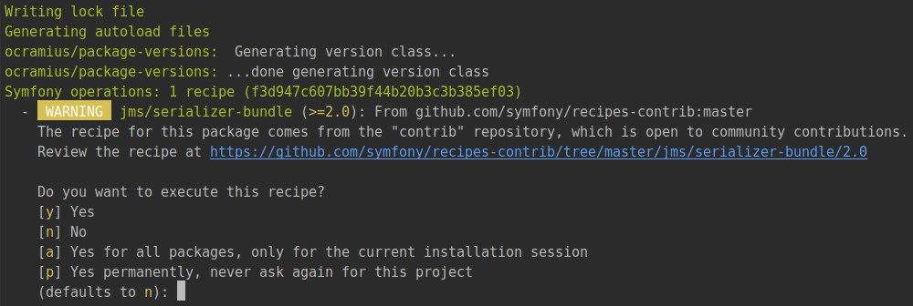
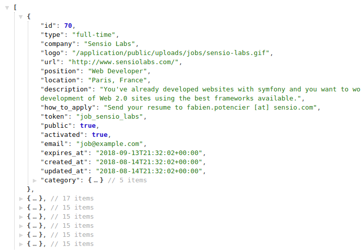

# Jobeet Day 12: The API

When you post a job, you will want to have the greatest exposure possible.
If your job is syndicated on a lot of small sites, you will have a better chance to find the right person. That’s the power of the [long tail][1].
Affiliates will be able to publish the latest posted jobs on their sites thanks to the API we will develop along this day.

## Affiliates

As per [day 2](day-2.md) requirements:

> "Story F7: An affiliate retrieves the current active job list"

### The Fixtures

> Note! There was a change in day 3: in file `src/Entity/Affiliate.php` method `setCategories` was replaced by two methods
> `addCategory` and `removeCategory`. Please check if you have these methods in Affiliate class and compare it with file from [day 3](day-3.md).

Let’s create a new fixture file for the affiliates:

```php
namespace App\DataFixtures;

use App\Entity\Affiliate;
use Doctrine\Bundle\FixturesBundle\Fixture;
use Doctrine\Common\DataFixtures\OrderedFixtureInterface;
use Doctrine\Common\Persistence\ObjectManager;

class AffiliateFixtures extends Fixture implements OrderedFixtureInterface
{
    /**
     * @param ObjectManager $manager
     *
     * @return void
     */
    public function load(ObjectManager $manager) : void
    {
        $affiliateSensioLabs = new Affiliate();
        $affiliateSensioLabs->setUrl('http://www.sensiolabs.com/');
        $affiliateSensioLabs->setEmail('contact@sensiolabs.com');
        $affiliateSensioLabs->setActive(true);
        $affiliateSensioLabs->setToken('sensio_labs');
        $affiliateSensioLabs->addCategory($manager->merge($this->getReference('category-programming')));

        $affiliateKNPLabs = new Affiliate();
        $affiliateKNPLabs->setUrl('http://www.knplabs.com/');
        $affiliateKNPLabs->setEmail('hello@knplabs.com');
        $affiliateKNPLabs->setActive(true);
        $affiliateKNPLabs->setToken('knp_labs');
        $affiliateKNPLabs->addCategory($manager->merge($this->getReference('category-programming')));
        $affiliateKNPLabs->addCategory($manager->merge($this->getReference('category-design')));

        $manager->persist($affiliateSensioLabs);
        $manager->persist($affiliateKNPLabs);

        $manager->flush();
    }

    /**
     * @return int
     */
    public function getOrder() : int
    {
        return 3;
    }
}
```

In the fixtures file, tokens are hardcoded to simplify the testing, but when an actual user applies for an account, the token will need to be generated.
Create a new listener in `src/EventListener` folder:

```php
namespace App\EventListener;

use App\Entity\Affiliate;
use Doctrine\ORM\Event\LifecycleEventArgs;

class AffiliateTokenListener
{
    /**
     * @param LifecycleEventArgs $args
     */
    public function prePersist(LifecycleEventArgs $args)
    {
        $entity = $args->getEntity();

        if (!$entity instanceof Affiliate) {
            return;
        }

        if (!$entity->getToken()) {
            $entity->setToken(\bin2hex(\random_bytes(10)));
        }
    }
}
```

Register this listener in `config/services.yaml`:

```yaml
# ...

services:
    # ...
    
    App\EventListener\AffiliateTokenListener:
        tags:
            - { name: doctrine.event_listener, event: prePersist }
```

Now you can reload fixtures:

```bash
bin/console doctrine:fixtures:load
```

## The Job API

### Setup bundles

To create the job API we gonna use bunch of two bundles: [JMSSerializerBundle][3] and [FOSRestBundle][2].
**JMSSerializerBundle** is used to easily serialize and deserialize data, and **FOSRestBundle** provides various tools to rapidly develop RESTful API’s.

First install [JMSSerializerBundle][3]:

```bash
composer require jms/serializer-bundle ^2.4
```

During the installation you will be asked if recipe from **contrib** repository should be applied:



Our suggestion is to answer `y` *(Yes)*.  
Thanks to Symfony Flex and this recipe bundle will be automatically connected in `config/bundles.php` and next configuration files will be created:

* `config/packages/dev/jms_serializer.yaml`
* `config/packages/jms_serializer.yaml`

Next install [FOSRestBundle][2]:

```bash
composer require friendsofsymfony/rest-bundle ^2.3
```

There will be the same question and after that new config file will appear: `config/packages/fos_rest.yaml`.  
We have bundles installed and initial configuration created!

### Create Controller

It is good practice to separate API routes and controllers as we did with admin routes:

* all controllers will be placed in `src/Controller/API`
* all routes will start with `/api/v1/`


Create first API controller in folder `src/Controller/API`:

```php
namespace App\Controller\API;

use FOS\RestBundle\Controller\FOSRestController;

class JobController extends FOSRestController
{

}
```

Notice that this controller extends `FOSRestController` class from `FOSRestBundle` package.
This parent controller provides some helper methods that we will use.

And modify `config/routes/annotations.yaml`:

```diff
  controllers:
      resource: ../../src/Controller/
      type: annotation
  
+ api_controllers:
+     resource: ../../src/Controller/API/
+     type: annotation
+     prefix: /api/v1/
```

This change prepend `/api/v1/` to all routes from `src/Controller/API/` folder and we don’t have to track it for each API route.

Routes configuration is done and let’s create our first action:

```php
namespace App\Controller\API;

use App\Entity\Affiliate;
use App\Entity\Job;
use Doctrine\ORM\EntityManagerInterface;
use FOS\RestBundle\Controller\FOSRestController;
use FOS\RestBundle\Controller\Annotations as Rest;
use Symfony\Component\HttpFoundation\Response;

class JobController extends FOSRestController
{
    /**
     * @Rest\Get("/{token}/jobs", name="api.job.list")
     *
     * @param Affiliate $affiliate
     * @param EntityManagerInterface $em
     *
     * @return Response
     */
    public function getJobsAction(Affiliate $affiliate, EntityManagerInterface $em) : Response
    {
        $jobs = $em->getRepository(Job::class)->findActiveJobs();

        return $this->handleView($this->view($jobs, Response::HTTP_OK));
    }
}
```

Do small adjustments in configuration file `config/packages/fos_rest.yaml` of the FOSRestBundle:

```yaml
fos_rest:
    format_listener:
        rules:
            - { path: ^/api, prefer_extension: true, fallback_format: json, priorities: [ json ] }
            - { path: ^/, prefer_extension: true, fallback_format: html,  priorities: [ html, '*/*'] }
```

Here we have two rules:

* rule for routes starting with `/api` - response will be serialized into json
* rule for all other routes - response will be formatted with twig, as it was before

It was the only thing you need to configure in FOSRestBundle.

Now try to open [http://127.0.0.1/api/v1/sensio_labs/jobs][4] link. You should see something similar:



> We use next extension for Chrome to beautify JSON output: [JSON Formatter][5].

What we did here:

* fetched affiliate by token from route (in our case token is `sensio_labs`)
* used `view` method to create `View` object with all jobs and 200 response code inside
* used `handleView` method to convert `View` object into response object

What is not done yet:

* check if affiliate is active
* return only jobs related to affiliate
* modify job serialization process

### Serialization

If you look closely to the result, you will see that everything from the database is returned, including jobs and affiliates from the category of a job and that’s too much.
To limit the returned data we will use some methods from the **JMSSerializerBundle** we installed earlier.

Open the `src/Entity/Job.php` entity file and add the following annotations and new methods:

```php
// ...
use JMS\Serializer\Annotation as JMS;

/**
 * ...
 *
 * @JMS\ExclusionPolicy("all")
 */
class Job
{
    // ...

    /**
     * ...
     *
     * @JMS\Expose()
     * @JMS\Type("int")
     */
    private $id;

    /**
     * ...
     *
     * @JMS\Expose()
     * @JMS\Type("string")
     */
    private $type;

    /**
     * ...
     *
     * @JMS\Expose()
     * @JMS\Type("string")
     */
    private $company;

    /**
     * ...
     */
    private $logo;

    /**
     * ...
     *
     * @JMS\Expose()
     * @JMS\Type("string")
     */
    private $url;

    /**
     * ...
     *
     * @JMS\Expose()
     * @JMS\Type("string")
     */
    private $position;

    /**
     * ...
     *
     * @JMS\Expose()
     * @JMS\Type("string")
     */
    private $location;

    /**
     * ...
     *
     * @JMS\Expose()
     * @JMS\Type("string")
     */
    private $description;

    /**
     * ...
     *
     * @JMS\Expose()
     * @JMS\Type("string")
     */
    private $howToApply;

    /**
     * ...
     */
    private $token;

    /**
     * ...
     */
    private $public;

    /**
     * ...
     */
    private $activated;

    /**
     * ...
     */
    private $email;

    /**
     * ...
     *
     * @JMS\Expose()
     * @JMS\Type("DateTime")
     */
    private $expiresAt;

    /**
     * ...
     */
    private $createdAt;

    /**
     * ...
     */
    private $updatedAt;

    /**
     * ...
     */
    private $category;

    // ...

    /**
     * @JMS\VirtualProperty
     * @JMS\SerializedName("logo_path")
     *
     * @return string|null
     */
    public function getLogoPath()
    {
        return $this->getLogo() ? 'uploads/jobs/' . $this->getLogo() : null;
    }

    /**
     * @JMS\VirtualProperty
     * @JMS\SerializedName("category_name")
     *
     * @return string
     */
    public function getCategoryName()
    {
        return $this->getCategory()->getName();
    }
}
```

*Work in progress*

## The Affiliate Application Form

*Work in progress*

## Additional information

*Work in progress*

## The Affiliate CRUD for Admin

*Work in progress*

## Next Steps

Continue this tutorial here: Jobeet Day 13: The Mailer

Previous post is available here: [Jobeet Day 11: The User](day-11.md)

Main page is available here: [Symfony 4.1 Jobeet Tutorial](../index.md)

[1]: https://en.wikipedia.org/wiki/Long_tail
[2]: https://symfony.com/doc/1.5/bundles/FOSRestBundle/index.html
[3]: https://github.com/schmittjoh/JMSSerializerBundle
[4]: http://127.0.0.1/api/v1/sensio_labs/jobs
[5]: https://chrome.google.com/webstore/detail/json-formatter/bcjindcccaagfpapjjmafapmmgkkhgoa
