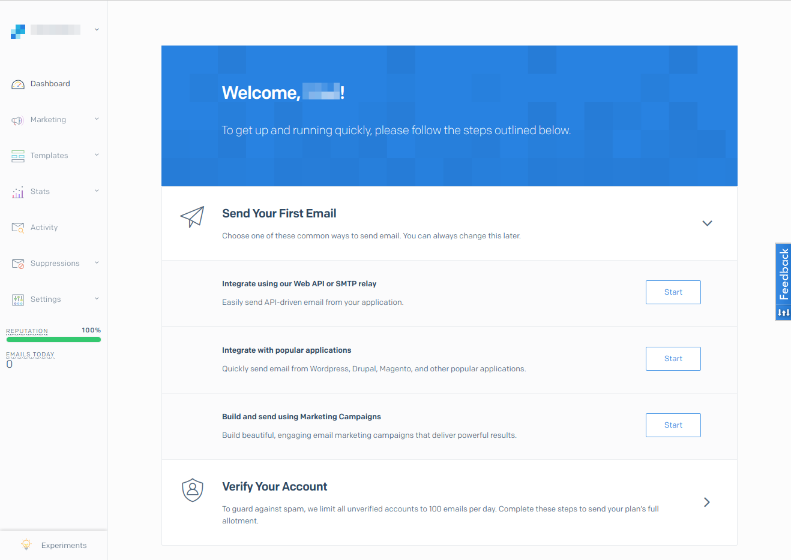
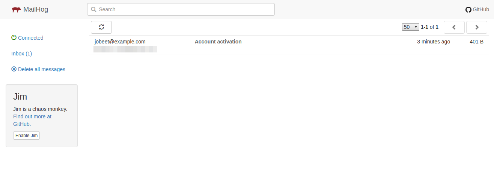

# Jobeet Day 13: The Mailer

Yesterday, we added a read-only web service to Jobeet.
Affiliates can now create an account but it needs to be activated by the administrator before it can be used.
In order for the affiliate to get its token, we still need to implement the email notification.
That’s what we will start doing in the coming lines.

The Symfony Framework comes bundled with one of the best PHP emailing solution: [Swift Mailer][2].
Of course, the library is fully integrated with symfony, with some cool features added on top of its default features via [SwiftMailerBundle][3].

### Mailer Transport

By default, Swift Mailer tries to use a local [SMTP][4] server to send the message to the recipient and it’s not very easy to setup it correctly.
Big mailing servers, like Gmail, have strict requirements for emails.
Bad configured emails will be automatically moved to spam folder or completely rejected.

In this case it’s better to use 3rd party mailing services, such as [SendGrid][5].
They offer 40,000 emails for your first 30 days, then 100 emails/day, forever.
It’s quite enough for the beginning.

Start with creation of the account on this page: [https://signup.sendgrid.com/][6].

After registration you will see the dashboard with welcome message:



Next, setup Symfony to use SendGrid and your newly created account.
Edit `MAILER_URL` variable in `.env` file:

```diff
- MAILER_URL=null://localhost
+ MAILER_URL=smtp://smtp.sendgrid.net:587?username=YOUR_USERNAME&password=YOUR_PASSWORD
```

Insert your username (not email) instead of `YOUR_USERNAME` and password instead of `YOUR_PASSWORD`.

That’s all! You are ready to use SendGrid in Symfony project.

### Sending simple Emails

Let’s start by sending a simple email to notify the affiliate when his account has been confirmed and to give him the affiliate token.

Replace the activate action with the following code:

```php
namespace App\Controller\Admin;

// ...

class AffiliateController extends AbstractController
{
    // ...

    /**
     * ...
     *
     * @param EntityManagerInterface $em
     * @param Affiliate $affiliate
     * @param \Swift_Mailer $mailer
     *
     * @return Response
     */
    public function activate(EntityManagerInterface $em, Affiliate $affiliate, \Swift_Mailer $mailer) : Response
    {
        $affiliate->setActive(true);
        $em->flush();

        $message = (new \Swift_Message())
            ->setSubject('Account activation')
            ->setTo($affiliate->getEmail())
            ->setFrom('jobeet@example.com')
            ->setBody('Your account has been activated successfully! Your token is: ' . $affiliate->getToken());

        $mailer->send($message);

        return $this->redirectToRoute('admin.affiliate.list');
    }
    
    // ...
}
```

> For the code to work properly, you should change the `jobeet@example.com` email address to a real one.

Sending the message is then as simple as calling the `send()` method on the mailer instance and passing the message as an argument.

The email message is an instance of the `Swift_Message` class.
Refer to the Swift Mailer official [documentation][7] to learn more about this object, and how to do more advanced stuff like attaching files.

### Refactoring

We remember about good practices and thin controllers.
Building of email in controller break these rules.
Create separate service class, where all the logic related to emails will be placed:

```php
namespace App\Service;

use App\Entity\Affiliate;
use Swift_Mailer;
use Swift_Message;

class MailerService
{
    /** @var Swift_Mailer */
    private $mailer;

    /**
     * @param Swift_Mailer $mailer
     */
    public function __construct(Swift_Mailer $mailer)
    {
        $this->mailer = $mailer;
    }

    /**
     * @param Affiliate $affiliate
     */
    public function sendActivationEmail(Affiliate $affiliate): void
    {
        $message = (new Swift_Message())
            ->setSubject('Account activation')
            ->setTo($affiliate->getEmail())
            ->setFrom('jobeet@example.com')
            ->setBody('Your account has been activated successfully! Your token is: ' . $affiliate->getToken());

        $this->mailer->send($message);
    }
}
```

And use new service in `AffiliateController`:

```php
namespace App\Controller\Admin;

// ...
use App\Service\MailerService;

class AffiliateController extends AbstractController
{
    // ...

    /**
     * ...
     *
     * @param EntityManagerInterface $em
     * @param Affiliate $affiliate
     * @param MailerService $mailer
     *
     * @return Response
     */
    public function activate(EntityManagerInterface $em, Affiliate $affiliate, MailerService $mailerService) : Response
    {
        $affiliate->setActive(true);
        $em->flush();

        $mailerService->sendActivationEmail($affiliate);

        return $this->redirectToRoute('admin.affiliate.list');
    }
    
    // ...
}
```

Now controller looks better!

### Emails with template

The body of message looks very simple now, just plain text, but what if we want to add some HTML?

Create template `templates/emails/affiliate_activation.html.twig` with the same message and some HTML tags added:

```twig
<p>Your account has been activated successfully!</p>
<p>Your token is: <b>{{ token }}</b></p>
```

Twig compiler is represented by `EngineInterface`. Inject it into `MailerService` and use it to render created template:

```php
namespace App\Service;

use App\Entity\Affiliate;
use Swift_Mailer;
use Swift_Message;
use Symfony\Component\Templating\EngineInterface;

class MailerService
{
    /** @var Swift_Mailer */
    private $mailer;

    /** @var EngineInterface */
    private $templateEngine;

    /**
     * @param Swift_Mailer $mailer
     * @param EngineInterface $templateEngine
     */
    public function __construct(Swift_Mailer $mailer, EngineInterface $templateEngine)
    {
        $this->mailer = $mailer;
        $this->templateEngine = $templateEngine;
    }

    /**
     * @param Affiliate $affiliate
     */
    public function sendActivationEmail(Affiliate $affiliate): void
    {
        $message = (new Swift_Message())
            ->setSubject('Account activation')
            ->setTo($affiliate->getEmail())
            ->setBody(
                $this->templateEngine->render(
                    'emails/affiliate_activation.html.twig',
                    [
                        'token' => $affiliate->getToken(),
                    ]
                ),
                'text/html'
            );

        $this->mailer->send($message);
    }
}
```

Now we can add more advanced slicing for emails!

### Configuration

You can choose to have all email sent to a specific address or a list of addresses, instead of the address actually specified when sending the message.
This can be done via the `delivery_addresses` option in file `config/packages/dev/swiftmailer.yaml`:

```yaml
swiftmailer:
    delivery_addresses: ['dev@example.com']
```

It will prevent sending of emails to real addresses of users.

### MailHog

> Important! Skip this section if you don’t use Docker.

If you don’t want to use 3rd party services and `delivery_addresses` option in development to catch all emails, you can use MailHog.
[MailHog][9] is an Docker image with SMTP server inside that catches all outgoing emails and shows them in convenient interface. 

First add MailHog to `docker-compose.yml`:

```yaml
version: "3.1"
services:
    # ...

    mailhog:
        image: mailhog/mailhog:v1.0.0
        container_name: jobeet-mailhog
        ports:
            - 1025:1025
            - 8025:8025
```

Add installation of special build of `sendmail` to `docker/php-fpm/Dockerfile` file:

```dockerfile
# Link MailHog
RUN curl -Lsf 'https://storage.googleapis.com/golang/go1.8.3.linux-amd64.tar.gz' | tar -C '/usr/local' -xvzf -
ENV PATH /usr/local/go/bin:$PATH
RUN go get github.com/mailhog/mhsendmail
RUN cp /root/go/bin/mhsendmail /usr/bin/mhsendmail
```

Stop all containers and start them again:
```bash
docker-compose stop
docker-compose up -d
```

> PHP container will be rebuilt because we changed build process.

Setup in `.env` file to send emails to `mailhog`:

```diff
- MAILER_URL=null://localhost
+ MAILER_URL=smtp://mailhog:1025
```

Open [http://127.0.0.1:8025/][10] and trigger sending of email from interface:



Here you can see all emails sent by the application.

That’s all for today, you can find the code here: [https://github.com/gregurco/jobeet/tree/day13][1]

## Additional information

- [How to Send an Email][3]
- [How to Work with Emails during Development][8]

## Next Steps

Continue this tutorial here: Jobeet Day 14: Translations

Previous post is available here: [Jobeet Day 12: The API](day-12.md)

Main page is available here: [Symfony 4.1 Jobeet Tutorial](../index.md)

[1]: https://github.com/gregurco/jobeet/tree/day13
[2]: https://swiftmailer.symfony.com/
[3]: https://symfony.com/doc/4.1/email.html
[4]: https://en.wikipedia.org/wiki/Simple_Mail_Transfer_Protocol
[5]: https://sendgrid.com/
[6]: https://signup.sendgrid.com/
[7]: https://swiftmailer.symfony.com/docs/introduction.html
[8]: https://symfony.com/doc/4.1/email/dev_environment.html
[9]: https://hub.docker.com/r/mailhog/mailhog/
[10]: http://127.0.0.1:8025/
