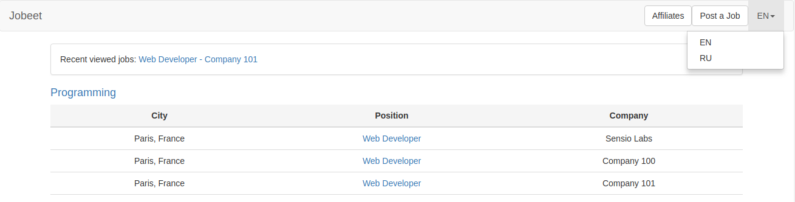

# Jobeet Day 14: Translations

Yesterday, we finished the mailing feature by connecting external service.
Now, we will talk about Jobeet internationalization (or i18n) and localization (or l10n).

From [Wikipedia][3]:

> **Internationalization** is the process of designing a software application so that it can be adapted to various languages and regions without engineering changes.
>
> **Localization** is the process of adapting software for a specific region or language by adding locale-specific components and translating text.

## Configuration

Symfony comes with [translations][4] package out of the box. We don’t have to install it.  
Also we have initial configuration in `config/packages/translation.yaml` file:

```yaml
framework:
    default_locale: '%locale%'
    translator:
        # ...
        fallbacks:
            - '%locale%'
```

Variable `%locale%` is defined in file `config/services.yaml` and value is `'en'`.
We can start with that configuration without any changes.

## Locale in the URL

**Note!** We will use Russian to show how to integrate second language in Symfony.
Feel free to integrate any other language you know.
Just write [ISO 639-1][11] code of the language you want instead of `ru` (`fr` - French, `de` - German, etc...).

The Jobeet site will be available in English and Russian.
As an URL can only represent a single resource, the culture must be embedded in the URL.
In order to do that, open the `config/routes/annotations.yaml` file, and add `prefix` for all routes (except API).

```yaml
controllers:
    resource: ../../src/Controller/
    type: annotation
    prefix:
        en: ''
        ru: '/ru'

api_controllers:
    # ...
```

Do the same change in `config/routes.yaml` for routes defined by FOSUserBundle:

```yaml
# ...

fos_user:
    resource: "@FOSUserBundle/Resources/config/routing/security.xml"
    prefix:
        en: ''
        ru: '/ru'
```

When the `prefix` with locale variable is used in a route, Symfony will automatically use its value.  
If you want to test that, then just add somewhere in `templates/base.html.twig` next code `{{ dump(app.request.locale) }}` and open homepage.
You will see `en` value, because it’s configured as default locale.
Then open URL [http://127.0.0.1/ru/][5] and `ru` will be displayed.
That means symfony understands the locale from URL.

Also it’s possible to check current locale through Profiler:
click on Profiler Bar in the bottom of the page, find `Request / Response` tab in the left menu and in section `Request Attributes` you can see `_locale` parameter.

## Language Switching

For the user to change the language, a [dropdown][6] must be added in the layout.

First of all define the list of languages supported by the system.
Add it in `config/services.yaml` file:

```diff
  parameters:
      locale: 'en'
+     locales: ['en', 'ru']
      max_jobs_on_homepage: 10
      # ...
```

And define as global twig variable in `config/packages/twig.yaml`:

```diff
  twig:
      paths: ['%kernel.project_dir%/templates']
      debug: '%kernel.debug%'
      strict_variables: '%kernel.debug%'
      globals:
          max_jobs_on_homepage: '%max_jobs_on_homepage%'
          jobs_web_directory: '%jobs_web_directory%'
+         locales: '%locales%'
      form_themes:
          - 'bootstrap_3_horizontal_layout.html.twig'
```

Later we will use this variable to render selector.

Till now, we connected only CSS file from bootstrap library using CDN, but now we need JS file too which requires [jQuery][8].
Let’s see how to connect CSS/JS libraries in Symfony way!

> **Important!** Skip to `npm install` command, if you don’t use docker and have Node.js installed locally.

Add [Node.js][7] container in `docker-compose.yml` file:

```yaml
version: "3.1"
services:
    # ...

    node:
        image: node:9.11.1
        container_name: jobeet-node
        working_dir: /application
        volumes:
        - .:/application
```

This container has **Node.JS** and **npm** inside.
Npm is a package manager for JavaScript (like Composer for PHP).

Build and run Node.js container:

```bash
docker-compose up -d
```

Enter in PHP container and install [encore][14] package:

```bash
docker-compose run php-fpm bash
composer require encore
```

Exit from PHP and enter in Node.js container:

```bash
exit
docker-compose run node bash
```

Install packages from package.json file:

```bash
yarn install
```

Install jQuery and Bootstrap:

```bash
yarn add jquery@^3.3.1 --dev
yarn add bootstrap@^3.3.7 --dev
```

Modify main js file (`assets/js/app.js`), which will be included on all pages.
Trigger `dropdown` from bootstrap library on all elements with `dropdown-toggle` class:

```js
// require jQuery normally
var $ = require('jquery');

// create global $ and jQuery variables
global.$ = global.jQuery = $;

require('bootstrap');

$(document).ready(function() {
  $(".dropdown-toggle").dropdown();
});
```

Symfony provides us a file with initial webpack configuration - `webpack.config.js`.
Activate jQuery there:

```diff
  var Encore = require('@symfony/webpack-encore');
  
  Encore
      // directory where compiled assets will be stored
      .setOutputPath('public/build/')
      // public path used by the web server to access the output path
      .setPublicPath('/build')
      // only needed for CDN's or sub-directory deploy
      //.setManifestKeyPrefix('build/')
  
      /*
       * ENTRY CONFIG
       *
       * Add 1 entry for each "page" of your app
       * (including one that's included on every page - e.g. "app")
       *
       * Each entry will result in one JavaScript file (e.g. app.js)
       * and one CSS file (e.g. app.css) if you JavaScript imports CSS.
       */
      .addEntry('app', './assets/js/app.js')
      //.addEntry('page1', './assets/js/page1.js')
      //.addEntry('page2', './assets/js/page2.js')
  
      // When enabled, Webpack "splits" your files into smaller pieces for greater optimization.
      .splitEntryChunks()
  
      // will require an extra script tag for runtime.js
      // but, you probably want this, unless you're building a single-page app
      .enableSingleRuntimeChunk()
  
      /*
       * FEATURE CONFIG
       *
       * Enable & configure other features below. For a full
       * list of features, see:
       * https://symfony.com/doc/current/frontend.html#adding-more-features
       */
      .cleanupOutputBeforeBuild()
      .enableBuildNotifications()
      .enableSourceMaps(!Encore.isProduction())
      // enables hashed filenames (e.g. app.abc123.css)
      .enableVersioning(Encore.isProduction())
  
      // enables Sass/SCSS support
      //.enableSassLoader()
  
      // uncomment if you use TypeScript
      //.enableTypeScriptLoader()
  
      // uncomment if you're having problems with a jQuery plugin
-     //.autoProvidejQuery()
+     .autoProvidejQuery()
+     .autoProvideVariables({
+         $: 'jquery',
+         jQuery: 'jquery',
+         'window.jQuery': 'jquery'
+     })
  
      // uncomment if you use API Platform Admin (composer req api-admin)
      //.enableReactPreset()
      //.addEntry('admin', './assets/js/admin.js')
  ;
  
  module.exports = Encore.getWebpackConfig();
```

Build assets with next command in Node.js container:

```bash
yarn encore dev
```

You can notice that new `app.js` file appeared in folder `public/build/js`.
This file is build using webpack and contains all JavaScript code required for our application.
Include this file in base layout (`templates/base.html.twig`) and add dropdown to select the language:

```diff
  <!DOCTYPE html>
  <html>
  <head>
      <title>{{ 'job.base.title'|trans }}</title>
  
      <meta http-equiv="Content-Type" content="text/html; charset=utf-8"/>
  
      
  
+     <script src="{{ asset('build/js/app.js') }}"></script>
      
  
      <link rel="stylesheet" href="https://maxcdn.bootstrapcdn.com/bootstrap/3.3.7/css/bootstrap.min.css">
  </head>
  <body>
  <nav class="navbar navbar-default">
      <div class="container-fluid">
          <div class="navbar-header">
              <a class="navbar-brand" href="{{ path('job.list') }}">{{ 'job.base.list'|trans }}</a>
          </div>
  
          <div class="collapse navbar-collapse">
              <ul class="nav navbar-nav navbar-right">
                  
                      <li>
                          <div>
                              <a href="{{ path('admin.category.list') }}" class="btn btn-default navbar-btn">{{ 'admin_panel'|trans }}</a>
                          </div>
                      </li>
                  
  
                  <li>
                      <div>
                          <a href="{{ path('affiliate.create') }}" class="btn btn-default navbar-btn">{{ 'affiliates'|trans }}</a>
                      </div>
                  </li>
  
                  <li>
                      <div>
                          <a href="{{ path('job.create') }}" class="btn btn-default navbar-btn">{{ 'job.base.create'|trans }}</a>
                      </div>
                  </li>
  
+                 <li class="dropdown">
+                     <a href="#" class="dropdown-toggle" data-toggle="dropdown" role="button" aria-haspopup="true" aria-expanded="false">{{ app.request.locale|upper }}<span class="caret"></span></a>
+                     <ul class="dropdown-menu">
+                         
+                             <li>
+                                 <a href="{{ path(app.request.get('_route'), app.request.attributes.get('_route_params')|merge({'_locale': locale})) }}">
+                                     {{ locale|upper }}
+                                 </a>
+                             </li>
+                         
+                     </ul>
+                 </li>
  
                  
                      <li><a href="{{ path('fos_user_security_logout') }}">{{ 'logout'|trans }}</a></li>
                  
              </ul>
          </div>
      </div>
  </nav>
  
  <div class="container">
      
  </div>
  </body>
  </html>
```

Here we get the list of languages, defined as global variable for twig and display as dropdown options.
When users will switch to another language, we want to keep them on the same page and just to change the locale.
For example, from page `http://127.0.0.1/job/5` we will switch to `http://127.0.0.1/ru/job/5` and not to homepage.  
That’s why we used `app.request.get('_route')` as the first argument to `path` function.
It returns the name of opened page.  
Also we want to keep all get parameters from the current route and just to add/rewrite `_locale` parameter: `app.request.attributes.get('_route_params')|merge({'_locale': locale})`.

Now selector works and language is mentioned in URL.



## Internationalization

### Templates

An internationalized site means that the user interface is translated into several languages.

In a template, all strings that are language dependent must be passed through `trans` filter.

Here is how to use it for the Jobeet layout:

```diff
  <!DOCTYPE html>
  <html>
  <head>
-     <title>Jobeet - Your best job board</title>
+     <title>{{ 'Jobeet - Your best job board'|trans }}</title>
  
      <meta http-equiv="Content-Type" content="text/html; charset=utf-8"/>
  
      
  
      <script src="{{ asset('build/js/app.js') }}"></script>
      
  
      <link rel="stylesheet" href="https://maxcdn.bootstrapcdn.com/bootstrap/3.3.7/css/bootstrap.min.css">
  </head>
  <body>
  <nav class="navbar navbar-default">
      <div class="container-fluid">
          <div class="navbar-header">
-             <a class="navbar-brand" href="{{ path('job.list') }}">Jobeet</a>
+             <a class="navbar-brand" href="{{ path('job.list') }}">{{ 'Jobeet'|trans }}</a>
          </div>
  
          <div class="collapse navbar-collapse">
              <ul class="nav navbar-nav navbar-right">
                  
                      <li>
                          <div>
-                             <a href="{{ path('admin.category.list') }}" class="btn btn-default navbar-btn">Admin Panel</a>
+                             <a href="{{ path('admin.category.list') }}" class="btn btn-default navbar-btn">{{ 'Admin Panel'|trans }}</a>
                          </div>
                      </li>
                  
  
                  <li>
                      <div>
-                         <a href="{{ path('affiliate.create') }}" class="btn btn-default navbar-btn">Affiliates</a>
+                         <a href="{{ path('affiliate.create') }}" class="btn btn-default navbar-btn">{{ 'Affiliates'|trans }}</a>
                      </div>
                  </li>
  
                  <li>
                      <div>
-                         <a href="{{ path('job.create') }}" class="btn btn-default navbar-btn">Post a Job</a>
+                         <a href="{{ path('job.create') }}" class="btn btn-default navbar-btn">{{ 'Post a Job'|trans }}</a>
                      </div>
                  </li>
  
                  <li class="dropdown">
                      <a href="#" class="dropdown-toggle" data-toggle="dropdown" role="button" aria-haspopup="true" aria-expanded="false">{{ app.request.locale|upper }}<span class="caret"></span></a>
                      <ul class="dropdown-menu">
                          
                              <li>
                                  <a href="{{ path(app.request.get('_route'), app.request.attributes.get('_route_params')|merge({'_locale': locale})) }}">{{ locale|upper }}</a>
                              </li>
                          
                      </ul>
                  </li>
  
                  
-                     <li><a href="{{ path('fos_user_security_logout') }}">Logout</a></li>
+                     <li><a href="{{ path('fos_user_security_logout') }}">{{ 'Logout'|trans }}</a></li>
                  
              </ul>
          </div>
      </div>
  </nav>
  
  <div class="container">
      
  </div>
  </body>
  </html>
```

When Symfony renders a template, each time the `trans` filter is called, Symfony looks for a translation for the current request locale.
If a translation is found, it is used, if not, the initial value is returned as a fallback value.

All translations are stored in `translations` folder.
The translations package provides a lot of different strategies to store the translations.
We will use the "XLIFF" format, which is a standard and the most flexible one.

> Other strategies are gettext, yaml, json, etc.

### translation:update

Instead of creating the translation file by hand, use the built-in `translation:update` command:

```bash
bin/console translation:update --prefix= --domain=messages --output-format xlf --force en
```

The `translation:update` command finds all strings that need to be translated in en in templates and creates or updates the corresponding translation files.
The `--force` option saves the new strings in the translation files.
You can also use the `--clean` option to automatically remove strings that do not exist anymore.

In our case, it populates the file we have created:

```xml
<?xml version="1.0" encoding="utf-8"?>
<xliff xmlns="urn:oasis:names:tc:xliff:document:1.2" version="1.2">
  <file source-language="en" target-language="en" datatype="plaintext" original="file.ext">
    <header>
      <tool tool-id="symfony" tool-name="Symfony"/>
    </header>
    <body>
      <trans-unit id="SwvMlQO" resname="Jobeet - Your best job board">
        <source>Jobeet - Your best job board</source>
        <target>Jobeet - Your best job board</target>
      </trans-unit>
      <trans-unit id="xqYQ02A" resname="Jobeet">
        <source>Jobeet</source>
        <target>Jobeet</target>
      </trans-unit>
      <trans-unit id="jC3twAE" resname="Admin Panel">
        <source>Admin Panel</source>
        <target>Admin Panel</target>
      </trans-unit>
      <trans-unit id="Y7SLIj4" resname="Affiliates">
        <source>Affiliates</source>
        <target>Affiliates</target>
      </trans-unit>
      <trans-unit id="e3cp8V6" resname="Post a Job">
        <source>Post a Job</source>
        <target>Post a Job</target>
      </trans-unit>
      <trans-unit id="0FJ_Sz1" resname="Logout">
        <source>Logout</source>
        <target>Logout</target>
      </trans-unit>
    </body>
  </file>
</xliff>
```

Each translation is managed by a `trans-unit` tag which has a unique `id` attribute.
You can now execute command for russian language (or another) and add translations for it:

```bash
bin/console translation:update --prefix= --domain=messages --output-format xlf --force ru
```

Edit file `translations/messages.ru.xlf`:

```xml
<?xml version="1.0" encoding="utf-8"?>
<xliff xmlns="urn:oasis:names:tc:xliff:document:1.2" version="1.2">
  <file source-language="en" target-language="ru" datatype="plaintext" original="file.ext">
    <header>
      <tool tool-id="symfony" tool-name="Symfony"/>
    </header>
    <body>
      <trans-unit id="SwvMlQO" resname="Jobeet - Your best job board">
        <source>Jobeet - Your best job board</source>
        <target>Jobeet - лучшая платформа для поиска работы</target>
      </trans-unit>
      <trans-unit id="xqYQ02A" resname="Jobeet">
        <source>Jobeet</source>
        <target>Jobeet</target>
      </trans-unit>
      <trans-unit id="jC3twAE" resname="Admin Panel">
        <source>Admin Panel</source>
        <target>Admin панель</target>
      </trans-unit>
      <trans-unit id="Y7SLIj4" resname="Affiliates">
        <source>Affiliates</source>
        <target>Партнёры</target>
      </trans-unit>
      <trans-unit id="e3cp8V6" resname="Post a Job">
        <source>Post a Job</source>
        <target>Опубликовать вакансию</target>
      </trans-unit>
      <trans-unit id="0FJ_Sz1" resname="Logout">
        <source>Logout</source>
        <target>Выйти</target>
      </trans-unit>
    </body>
  </file>
</xliff>
```

> As XLIFF is a standard format, a lot of tools exist to ease the translation process.
> You can use this [Free Online XLIFF Editor][9] to manage translations.

> As XLIFF is a file-based format, the same precedence and merging rules that exist for other Symfony configuration files are also applicable.
> Translations files can exist in a project or a bundle, and the most specific file overrides translations found in the more global ones.

### Translations with Arguments

The main principle behind internationalization is to translate whole sentences.
But some sentences embed dynamic values.  
In Jobeet, this is the case on the category page for the "Jobs in the ... category" page title:

```twig
Jobs in the {{ category.name }} category
```

The category name is a variable that must be replaced by a placeholder for translation:

```twig
{{ 'Jobs in the %category% category'|trans({'%category%': category.name}) }}
```

The string to be translated is now `Jobs in the %category% category`, and the `%category%` placeholder will be replaced by the real name at runtime, thanks to the value given as the argument to the `trans` filter.


Add the new string manually by inserting a trans-unit tag in the `messages.en.xlf` file, or use the `translation:update` command to update the file automatically:

```bash
bin/console translation:update --prefix= --domain=messages --output-format xlf --force en
```

After running the command, open the XLIFF file to check the English translation:

```xml
<trans-unit id="bVBmzKs" resname="Jobs in the %category% category">
  <source>Jobs in the %category% category</source>
  <target>Jobs in the %category% category</target>
</trans-unit>
```

The only requirement in the translated string is to use the `%category%` placeholder somewhere.

Some other strings are even more complex as they involve plurals.
According to some numbers, the sentence changes, but not necessarily the same way for all languages.
Some languages have very complex grammar rules for plurals, like Polish or Russian.

In the control panel (`templates/job/control_panel.html.twig`), the number of days before expiring is displayed:

```twig

    <p class="navbar-text">{{ 'Expired'|trans }}</p>

    <p class="navbar-text">{{ 'Expires in %days% days'|trans({'%days%': job.expiresAt.diff(date())|date('%a')}) }}</p>

```

When a sentence has different translations according to a number, the `transchoice` filter should be used:

```twig
{% set daysToExpiring = job.expiresAt.diff(date())|date('%a') %}

{% transchoice daysToExpiring with {'%days%': daysToExpiring} %}
    ]-Inf,0] Expired|{1}Expires in 1 day|]1,Inf[ Expires in %days% days

```

The `transchoice` has 3 parts:

* The string to use depending on the number
* An array of placeholders
* The number to use to determine which text to use

The string that describes the different translations according to the number is formatted as follows:

* Each possibility is separated by a pipe character (`|`)
* Each string is composed of a range followed by the translation

The range can describe any range of numbers:

* `[1,2]`: Accepts values between 1 and 2, inclusive
* `(1,2)`: Accepts values between 1 and 2, excluding 1 and 2
* `{1,2,3,4}`: Only values defined in the set are accepted
* `[-Inf,0)`: Accepts values greater or equal to negative infinity and strictly less than 0
* `{n: n % 10 > 1 && n % 10 < 5}`: Matches numbers like 2, 3, 4, 22, 23, 24

Translating the string is similar to other message strings:

```xml
<trans-unit id="hDTa85S" resname="]-Inf,0] Expired|{1}Expires in 1 day|]1,Inf[ Expires in %days% days">
  <source>]-Inf,0] Expired|{1}Expires in 1 day|]1,Inf[ Expires in %days% days</source>
  <target>]-Inf,0] Истекло|{1}Истекает через 1 день|]1,Inf[ Истекает через %days% дней</target>
</trans-unit>
```

### Links

In control panel we have one more special case.
We have text with link inside:

`templates/job/control_panel.html.twig`

```twig
[Bookmark this <a href="{{ url('job.preview', {token: job.token}) }}">URL</a> to manage this job in the future]
```

In this case we have to put `<a>` tag in translations, to pass URL as argument and to use `|raw` filter, not to escape the link: 

```twig
{{ '[Bookmark this <a href="%url%">URL</a> to manage this job in the future]'|trans({'%url%': path('job.preview', {token: job.token})})|raw }}
```

Be careful not to pass any information received from user to this type of translation, because it can cause [XSS][12] vulnerability.

Now that you know how to internationalize all kind of strings, take the time to add `trans` calls for all templates of the application.

### Forms

The form type classes contain many strings that need to be translated, like labels, error messages, and help messages.
All these strings are automatically internationalized by Symfony, so you only need to provide translations in the XLIFF files.

> Unfortunately, the `translation:update` command does not parse form type classes for untranslated strings.

## Final Thoughts

Internationalization and localization are first-class citizens in Symfony.
Providing a localized site to your users is very easy as symfony provides all the basic tools and even gives you command-line tasks to make it fast.

That’s all for today, you can find the code here: [https://github.com/gregurco/jobeet/tree/day14][1]

## Additional information

- [Managing CSS and JavaScript][15]
- [Documentation: Translations][2]
- [Documentation: Using the Translator][10]
- [Best Practices: Internationalization][13]

## Next Steps

Continue this tutorial here: Jobeet Day 15: The Unit Tests

Previous post is available here: [Jobeet Day 13: The Mailer](day-13.md)

Main page is available here: [Symfony 4.2 Jobeet Tutorial](../index.md)

[1]: https://github.com/gregurco/jobeet/tree/day14
[2]: https://symfony.com/doc/4.2/translation.html
[3]: https://en.wikipedia.org/wiki/Internationalization
[4]: https://packagist.org/packages/symfony/translation
[5]: http://127.0.0.1/ru/
[6]: https://getbootstrap.com/docs/3.3/javascript/#dropdowns
[7]: https://nodejs.org
[8]: https://jquery.com/
[9]: http://xliff.brightec.co.uk/
[10]: https://symfony.com/doc/4.2/components/translation/usage.html
[11]: https://en.wikipedia.org/wiki/ISO_639-1
[12]: https://en.wikipedia.org/wiki/Cross-site_scripting
[13]: https://symfony.com/doc/4.2/best_practices/i18n.html
[14]: https://github.com/symfony/webpack-encore-bundle
[15]: https://symfony.com/doc/4.2/frontend.html
