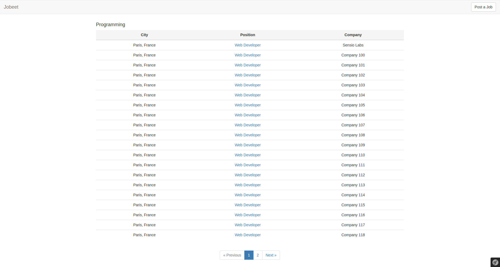

# Jobeet Day 7: Playing with the Category Page

Today we will make the Category page like it is described in the second day’s requirements:
*“The user sees a list of all the jobs from the category sorted by date and paginated with 20 jobs per page“.*

## The Category Route

First, let’s think about the route we will use for our category page.
We will define a pretty URL that will contain the category slug: `/category/{slug}` named `category.show`.

## Category slug

To have the slug of categories we will need [StofDoctrineExtensionsBundle][1] that wraps [DoctrineExtensions][1] package.
It consists of different useful extensions but we will use [Sluggable][2] only for now.

First let’s install the bundle:
```bash
composer require stof/doctrine-extensions-bundle
```

This bundle has recipe and symfony will ask you to run this recipe, because it’s not official one. Type `y` and accept it:
```bash
Symfony operations: 1 recipe (3c3199f3aa23ea62ee911b3d6fe61a93)
  -  WARNING  stof/doctrine-extensions-bundle (>=1.2): From github.com/symfony/recipes-contrib:master
    The recipe for this package comes from the "contrib" repository, which is open to community contributions.
    Do you want to execute this recipe?
    [y] Yes
    [n] No
    [a] Yes for all packages, only for the current installation session
    [p] Yes permanently, never ask again for this project
    (defaults to n): 
```

Read about [Flex][4] system to know more about recipes.

Activate `sluggable` extension in `config/packages/stof_doctrine_extensions.yaml`:
```yaml
stof_doctrine_extensions:
    default_locale: en_US
    orm:
        default:
            sluggable: true
```

Slug will be stored in DB and we need field for it. Add `slug` field in `Category` entity:
```php
// ...
use Gedmo\Mapping\Annotation as Gedmo;

class Category
{
    // ...

    /**
     * @var string
     *
     * @Gedmo\Slug(fields={"name"})
     *
     * @ORM\Column(type="string", length=128, unique=true)
     */
    private $slug;
    
    // ...
    
    /**
     * @return string|null
     */
    public function getSlug() : ?string
    {
        return $this->slug;
    }
    
    /**
     * @param string $slug
     */
    public function setSlug(string $slug): void
    {
        $this->slug = $slug;
    }
    
    // ...
}
```

Pay attention to `@Gedmo\Slug` annotation.

Generate migration that will add `slug` field in `category` table:
```bash
bin/console doctrine:migrations:diff
```

If we run migration now, we will see error, because we have several categories in DB without slug, that is required.
First of all we should drop database:
```bash
bin/console doctrine:schema:drop --force --full-database
```

Run migrations:
```bash
bin/console doctrine:migration:migrate
```

Run fixtures:
```bash
bin/console doctrine:fixtures:load
```

And check that categories have slug:
```bash
bin/console doctrine:query:sql 'SELECT * from categories'
```

The result should be similar:
```bash
array(4) {
  [0]=>
  array(3) {
    ["id"]=>
    string(1) "1"
    ["name"]=>
    string(6) "Design"
    ["slug"]=>
    string(6) "design"
  }
...
```

The main advantage of this bundle for us is that slug is generated automatically. We don’t call `setSlug` anywhere.

## The Job Category Controller

It’s now time to create the category controller. Create a new `CategoryController.php` file in your Controller directory:

```php
namespace App\Controller;

use Symfony\Bundle\FrameworkBundle\Controller\AbstractController;

class CategoryController extends AbstractController
{

}
```

## The Category Page

Add the following code to the `CategoryController.php` file:

```php
// ...
use App\Entity\Category;
use Symfony\Component\Routing\Annotation\Route;
use Symfony\Component\HttpFoundation\Response;

class CategoryController extends AbstractController
{
    /**
     * Finds and displays a category entity.
     *
     * @Route("/category/{slug}", name="category.show", methods="GET")
     *
     * @param Category $category
     *
     * @return Response
     */
    public function show(Category $category) : Response
    {
        return $this->render('category/show.html.twig', [
            'category' => $category,
        ]);
    }
}
```

The last step is to create the `templates/category/show.html.twig` template:

```twig



    Jobs in the {{ category.name }} category



    <h4>{{ category.name }}</h4>

    <table class="table text-center">
        <thead>
        <tr>
            <th class="active text-center">City</th>
            <th class="active text-center">Position</th>
            <th class="active text-center">Company</th>
        </tr>
        </thead>

        <tbody>
        
            <tr>
                <td>{{ job.location }}</td>
                <td>
                    <a href="{{ path('job.show', {id: job.id}) }}">
                        {{ job.position }}
                    </a>
                </td>
                <td>{{ job.company }}</td>
            </tr>
        
        </tbody>
    </table>

```

## Including Other Twig Templates

Notice that we have copied and pasted the `<table>` tag that create a list of jobs from the job `list.html.twig` template. That’s bad.
When you need to reuse some portion of a template, you need to create a new twig template with that code and include it where you need.

Create the `templates/job/table.html.twig` file:

```twig
<table class="table text-center">
    <thead>
    <tr>
        <th class="active text-center">City</th>
        <th class="active text-center">Position</th>
        <th class="active text-center">Company</th>
    </tr>
    </thead>

    <tbody>
    
        <tr>
            <td>{{ job.location }}</td>
            <td>
                <a href="{{ path('job.show', {id: job.id}) }}">
                    {{ job.position }}
                </a>
            </td>
            <td>{{ job.company }}</td>
        </tr>
    
    </tbody>
</table>
```

Notice that we changed one thing: we use to iterate `jobs` instead of `category.activeJobs`. It will help us in next step.

You can include a template by using the `` statement.
Replace the <table> HTML code from `templates/category/show.html.twig` with the include function:

```twig



    Jobs in the {{ category.name }} category



    <h4>{{ category.name }}</h4>

    

```

and `templates/job/list.html.twig`

```twig



    <h4>{{ category.name }}</h4>

    
        
    

```

We included table template with key words `with` and `only`. That means that we pass to table template **only** jobs variables.

> Read also about about [include function][8]

## The Category Link

Now, edit the `templates/job/list.html.twig` template of the job controller to add the link to the category page:

```diff
- <h4>{{ category.name }}</h4>
+ <h4>
+     <a href="{{ path('category.show', {slug: category.slug}) }}">{{ category.name }}</a>
+ </h4>
```

Now you can go from categories page to specific category page.

## List Pagination

To implement pagination we will use [KnpPaginatorBundle][5].

First, let’s install the bundle:

```bash
composer require knplabs/knp-paginator-bundle
```

Bundle is installed and ready to use.

As you can see in documentation of the bundle, paginator consumes doctrine query, not the result.
We need to create the new method in job repository `src/Repository/JobRepository.php`:
```php
// ...
use App\Entity\Category;
use Doctrine\ORM\AbstractQuery;

class JobRepository extends EntityRepository
{
    // ...

    /**
     * @param Category $category
     *
     * @return AbstractQuery
     */
    public function getPaginatedActiveJobsByCategoryQuery(Category $category) : AbstractQuery
    {
        return $this->createQueryBuilder('j')
            ->where('j.category = :category')
            ->andWhere('j.expiresAt > :date')
            ->setParameter('category', $category)
            ->setParameter('date', new \DateTime())
            ->getQuery();
    }
}
```

This method create query which will get all active jobs by category. But where is pagination?
Let’s do it in controller `src/Controller/CategoryController.php`:

```php
// ...
use App\Entity\Job;
use Knp\Component\Pager\PaginatorInterface;

class CategoryController extends AbstractController
{
    /**
     * Finds and displays a category entity.
     *
     * @Route("/category/{slug}", name="category.show", methods="GET")
     *
     * @param Category $category
     * @param PaginatorInterface $paginator
     *
     * @return Response
     */
    public function show(Category $category, PaginatorInterface $paginator) : Response
    {
        $activeJobs = $paginator->paginate(
            $this->getDoctrine()->getRepository(Job::class)->getPaginatedActiveJobsByCategoryQuery($category),
            1, // page
            10 // elements per page
        );

        return $this->render('category/show.html.twig', [
            'category' => $category,
            'activeJobs' => $activeJobs,
        ]);
    }
}
```

We added `PaginatorInterface` in parameters of the method and autowire component will inject paginator service automatically.
Also we call paginator and pass query from repository, page (for now let’s get only first) and how many element we want per page.
The result we send to template. Let’s use it there `templates/category/show.html.twig`:

```diff
- 
+ 
```

If now you open the  browser, you will see only 10 jobs on the page, but what about pagination?
How to access second page? And what if we want to have 20 element on the page?

First let’s define new parameter in `config/services.yaml`:
```yaml
parameters:
    # ...
    max_jobs_on_category: 20
```

and now some changes in `src/Controller/CategoryController.php`:

```php
namespace App\Controller;

use App\Entity\Category;
use App\Entity\Job;
use Knp\Component\Pager\PaginatorInterface;
use Symfony\Bundle\FrameworkBundle\Controller\Controller;
use Symfony\Component\Routing\Annotation\Route;
use Symfony\Component\HttpFoundation\Response;

class CategoryController extends Controller
{
    /**
     * Finds and displays a category entity.
     *
     * @Route(
     *     "/category/{slug}/{page}",
     *     name="category.show",
     *     methods="GET",
     *     defaults={"page": 1},
     *     requirements={"page" = "\d+"}
     * )
     *
     * @param Category $category
     * @param PaginatorInterface $paginator
     * @param int $page
     *
     * @return Response
     */
    public function show(
        Category $category,
        int $page,
        PaginatorInterface $paginator
    ) : Response {
        $activeJobs = $paginator->paginate(
            $this->getDoctrine()->getRepository(Job::class)->getPaginatedActiveJobsByCategoryQuery($category),
            $page,
            $this->getParameter('max_jobs_on_category')
        );

        return $this->render('category/show.html.twig', [
            'category' => $category,
            'activeJobs' => $activeJobs,
        ]);
    }
}
```

We added `page` in the URL path and defined default value, in case when page is not defined in the URL *(ex: `/category/design`)*.
Variable `$path` is added in arguments of the method. It will be injected automatically by name in path.
Also we need parameter `max_jobs_on_category` and `getParameter` methods to access it.
That’s why this controller extends now `Symfony\Bundle\FrameworkBundle\Controller\Controller` but not `Symfony\Bundle\FrameworkBundle\Controller\AbstractController`.

Now let’s render page selector in template `templates/category/show.html.twig`:

```twig



    Jobs in the {{ category.name }} category



    <h4>{{ category.name }}</h4>

    

    <div class="navigation text-center">
        {{ knp_pagination_render(activeJobs) }}
    </div>

```

Pagination will work but will look not in style of Bootstrap 3. Let’s configure it.
Create file `knp_paginator.yml` in `config/packages` and past there next code to change the style of paginator:

```yaml
knp_paginator:
    template:
        pagination: "@KnpPaginator/Pagination/twitter_bootstrap_v3_pagination.html.twig"
```

Notice: don’t forget to clear cache after that.

Now it should look like that:



That’s all for today, you can find the code here: [https://github.com/gregurco/jobeet/tree/day7][7]

See you tomorrow!

## Additional information
- [KnpPaginatorBundle][5]
- [Doctrine Pagination][6]

## Next Steps

Continue this tutorial here: [Jobeet Day 8: The Forms](day-8.md)

Previous post is available here: [Jobeet Day 6: More with the Entity](day-6.md)

Main page is available here: [Symfony 4.1 Jobeet Tutorial](../index.md)

[1]: https://symfony.com/doc/current/bundles/StofDoctrineExtensionsBundle/index.html
[2]: https://github.com/Atlantic18/DoctrineExtensions
[3]: https://github.com/Atlantic18/DoctrineExtensions/blob/v2.4.x/doc/sluggable.md#setup-and-autoloading
[4]: https://symfony.com/doc/4.1/setup/flex.html
[5]: https://github.com/KnpLabs/KnpPaginatorBundle
[6]: https://docs.doctrine-project.org/projects/doctrine-orm/en/latest/tutorials/pagination.html
[7]: https://github.com/gregurco/jobeet/tree/day7
[8]: https://twig.symfony.com/doc/2.x/functions/include.html
