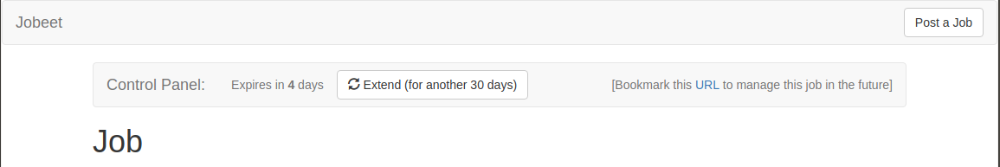

# Jobeet Day 8: The Forms

Any site has forms, from the simple contact form to the complex ones with lots of fields.
Writing forms is also one of the most complex and tedious task for a web developer: you need to write the HTML form, implement validation
rules for each field, process the values to store them in a database, display error messages, repopulate fields in case of errors, and much more…

## Create the Job Form

To deal with creation of jobs we will need forms, that in Symfony are realized by [Form Component][3].
The Form component allows you to easily create, process and reuse forms.
We will create a class that generally is `Form Builder` class. There we will define fields, that form should have, validation rules and many other things.
So, let’s create a folder `src/Form` where all forms will be placed. In the folder we are going to create our first form in file `JobType.php`:

```php
namespace App\Form;

use Symfony\Component\Form\AbstractType;
use Symfony\Component\Form\FormBuilderInterface;
use Symfony\Component\OptionsResolver\OptionsResolver;

class JobType extends AbstractType
{
    /**
     * {@inheritdoc}
     */
    public function buildForm(FormBuilderInterface $builder, array $options)
    {

    }

    /**
     * {@inheritdoc}
     */
    public function configureOptions(OptionsResolver $resolver)
    {

    }
}
```

As you can notice, our class extends `AbstractType` class and usually you will have to work with `buildForm` and `configureOptions` methods.
That’s why we defined them from the beginning.

Every form needs to know the name of the class that holds the underlying data.
Let’s specify the `data_class` option by changing `configureOptions` method:

```php
public function configureOptions(OptionsResolver $resolver)
{
    $resolver->setDefaults([
        'data_class' => Job::class,
    ]);
}
```

*Note: don’t forget to import `Job` class*

Now we should define form fields in `buildForm` method:

```php
// ....
use Symfony\Component\Form\Extension\Core\Type\EmailType;
use Symfony\Component\Form\Extension\Core\Type\TextType;
use Symfony\Component\Form\Extension\Core\Type\TextareaType;
use Symfony\Component\Form\Extension\Core\Type\UrlType;

class JobType extends AbstractType
{
    /**
     * {@inheritdoc}
     */
    public function buildForm(FormBuilderInterface $builder, array $options)
    {
        $builder
            ->add('type', TextType::class)
            ->add('company', TextType::class)
            ->add('logo', TextType::class)
            ->add('url', UrlType::class)
            ->add('position', TextType::class)
            ->add('location', TextType::class)
            ->add('description', TextareaType::class)
            ->add('howToApply', TextType::class)
            ->add('public', TextType::class)
            ->add('activated', TextType::class)
            ->add('email', EmailType::class)
            ->add('category', TextType::class)
            ->add('token', TextType::class);
    }
    
    // ...   
}
```

We call method `add` on form builder and add all fields one by one. First argument is the field name which is actually a property in the entity.
The second argument is the field type. In our case we used [TextType][6], [EmailType][7] and [DateTimeType][8]. And 3rd parameter is optional, we do not use it for now.
Field type affects rendering of field and also provides different options for configuration.

Example: `TextType` will be rendered as `<input type="text" ...>`

Let’s try other types. For example, we defined `public` field as `TextType`, but in entity it is boolean.
It’s better to render it as selector with YES and NO options. We will implement [ChoiceType][9]:

```diff
- ->add('public', TextType::class)
+ ->add('public', ChoiceType::class, [
+     'choices'  => [
+         'Yes' => true,
+         'No' => false,
+     ],
+     'label' => 'Public?',
+ ])
```

We changed type and also defined next options: `choices` - items, that will be used as `<options>` and `label`.
Do the same thing with `activated` field too.

Also `category` is `TextType`, but we have categories in DB and it would be good to render selector with these options.
It looks like it should be `ChoiceType`, but choice from entities is specific case and we have separate type for it: [EntityType][10].
It extends `ChoiceType` but with some additional options related to DB.

```diff
- ->add('category', TextType::class)
+ ->add('category', EntityType::class, [
+     'class' => Category::class,
+     'choice_label' => 'name',
+ ])
```

We specified `choice_label` to select a field from entity that will be shown as option in selector.
We changed only one line of code, but in template instead of simple input we will have select with all categories in options.

Now let’s change `type` field. For now it’s text field, but in the second day’s description we have next requirement:
> Type (full-time, part-time, or freelance)

We need defined list of options and let’s do it in `Job` entity:

```php
class Job
{
    public const FULL_TIME_TYPE = 'full-time';
    public const PART_TIME_TYPE = 'part-time';
    public const FREELANCE_TYPE = 'freelance';

    public const TYPES = [
        self::FULL_TIME_TYPE,
        self::PART_TIME_TYPE,
        self::FREELANCE_TYPE,
    ];

    // ...
}
```

Currently we can change the form type of `type` field to `ChoiceType`:

```diff
- ->add('type', TextType::class)
+ ->add('type', ChoiceType::class, [
+     'choices' => array_combine(Job::TYPES, Job::TYPES),
+     'expanded' => true,
+ ])
```

Why we used `array_combine` but not directly `Job::TYPES`? We want to show options with same label and value.
For example, option with label `freelance` should have value `freelance` (`<option value="freelance">freelance</option>`) and `array_combine` helps us to do that.
Also `expanded` is true to show you how different `ChoiceType` can be rendered. We will see it later.

Let’s add some labels and options. The final result should be:
```php
namespace App\Form;

use App\Entity\Category;
use App\Entity\Job;
use Symfony\Bridge\Doctrine\Form\Type\EntityType;
use Symfony\Component\Form\AbstractType;
use Symfony\Component\Form\Extension\Core\Type\ChoiceType;
use Symfony\Component\Form\Extension\Core\Type\EmailType;
use Symfony\Component\Form\Extension\Core\Type\TextType;
use Symfony\Component\Form\Extension\Core\Type\TextareaType;
use Symfony\Component\Form\Extension\Core\Type\UrlType;
use Symfony\Component\Form\FormBuilderInterface;
use Symfony\Component\OptionsResolver\OptionsResolver;

class JobType extends AbstractType
{
    /**
     * {@inheritdoc}
     */
    public function buildForm(FormBuilderInterface $builder, array $options)
    {
        $builder
            ->add('type', ChoiceType::class, [
                'choices' => array_combine(Job::TYPES, Job::TYPES),
                'expanded' => true,
            ])
            ->add('company', TextType::class)
            ->add('logo', TextType::class)
            ->add('url', UrlType::class)
            ->add('position', TextType::class)
            ->add('location', TextType::class)
            ->add('description', TextareaType::class)
            ->add('howToApply', TextType::class, [
                'label' => 'How to apply?',
            ])
            ->add('public', ChoiceType::class, [
                'choices'  => [
                    'Yes' => true,
                    'No' => false,
                ],
                'label' => 'Public?',
            ])
            ->add('activated', ChoiceType::class, [
                'choices'  => [
                    'Yes' => true,
                    'No' => false,
                ],
            ])
            ->add('email', EmailType::class)
            ->add('category', EntityType::class, [
                'class' => Category::class,
                'choice_label' => 'name',
            ])
            ->add('token', TextType::class);
    }

    /**
     * {@inheritdoc}
     */
    public function configureOptions(OptionsResolver $resolver)
    {
        $resolver->setDefaults([
            'data_class' => Job::class,
        ]);
    }
}
```

## Create Job Action

We have just created `JobType` form class. The next step is to create and render actual form.
In Symfony, this is done by building a form object and then rendering it in a template.
For now, we will create new action inside the `JobController` controller:

```php
// ...
use App\Form\JobType;

class JobController extends AbstractController
{
    // ...
    
    /**
     * Creates a new job entity.
     *
     * @Route("/job/create", name="job.create", methods="GET")
     *
     * @return Response
     */
    public function create() : Response
    {
        $job = new Job();
        $form = $this->createForm(JobType::class, $job);
    
        return $this->render('job/create.html.twig', [
            'form' => $form->createView(),
        ]);
    }
}
```

We created new Job object and passed it to `createForm` method along with `JobType` class.
This method will create a form class based on entity object and rules described in `JobType` class.
In form we will need a special form "view" object, that’s why we passed to template not the form, but the result of `createView` method.

## The Form Template

In the previous step we passed data to `job/create.html.twig` template, but we don’t have it yet.
Let’s create it and use a set of form helper functions:

```twig



    <h1>Job creation</h1>

    {{ form_start(form) }}
        {{ form_widget(form) }}

        <div class="form-group">
            <div class="col-sm-offset-2 col-sm-10">
                <button type="submit" class="btn btn-default">Create</button>
            </div>
        </div>
    {{ form_end(form) }}

```
That’s it! Form will be rendered due to:
- `form_start` - renders `<form>` tag with all needed attributed (method, encryption, etc).
- `form_widget` - renders all the fields, labels and any validation error messages.
- `form_end` - renders `</form>` tag.

Open the browser and access `/job/create` path to see how form is rendered.
The form with all fields are rendered, but the styling is not the same as in [bootstrap][11].
The good new is that [Twig Bridge][12] component, that is responsible for integration of Twig in Symfony, comes with some [themes][13] out of the box.
We use bootstrap 3 and will choose `bootstrap_3_horizontal_layout.html.twig` theme file. Let’s setup it in `config/packages/twig.yaml`:
```twig
twig:
    {# ... #}
    form_themes:
        - 'bootstrap_3_horizontal_layout.html.twig'
```

Refresh the page. Now form should look in bootstrap 3 style.

Also you may notice that we wrote HTML for submit button and did’t use [SubmitType][14].
It’s good practice because form become more reusable. Read more [here][15].

## Form processing

Form is built and rendered. Processing is next.
If you submit the form, nothing happens. Let’s fix it:

```php
class JobController extends AbstractController
{
    // ...
    
    /**
     * Creates a new job entity.
     *
     * @Route("/job/create", name="job.create", methods={"GET", "POST"})
     *
     * @param Request $request
     * @param EntityManagerInterface $em
     *
     * @return RedirectResponse|Response
     */
    public function create(Request $request, EntityManagerInterface $em) : Response
    {
        $job = new Job();
        $form = $this->createForm(JobType::class, $job);
        $form->handleRequest($request);

        if ($form->isSubmitted() && $form->isValid()) {
            $em->persist($job);
            $em->flush();

            return $this->redirectToRoute('job.list');
        }

        return $this->render('job/create.html.twig', [
            'form' => $form->createView(),
        ]);
    }
```

- we added `POST` method to annotation, because form will be submitted with this method.
- request object is added to method arguments because in request will be data of submitted form
- entity manager is added to method arguments because we will use it to store new job
- `handleRequest` method maps request data to form
- `isSubmitted` method checks if form was submitted or method is called with get method and we need only to show the form
- `isValid` method tracks if all requirements are met (we will add them in next step)
- `redirectToRoute` is used to redirect to list of jobs and to prevent repeated submit of form (CTRL + R)

## Validation

For now form is built, rendered and processed, but we don’t validate any information.
Form accepts anything. We should add some validation rules.

> Validation rules are called `constraints` in symfony forms.

There are two places where constraints can be added: in annotations of entity or in form class.
We will choose the second option, to keep the logic of form validation in form class and not to enlarge entity class.

Our first field in form is `type` field. According to entity this field should be required:

```diff
 ->add('type', ChoiceType::class, [
     'choices' => array_combine(Job::TYPES, Job::TYPES),
     'expanded' => true,
+    'constraints' => [
+        new NotBlank(),
+    ]
 ])
```

and import `Symfony\Component\Validator\Constraints\NotBlank` class.  
Next field is `company` and it’s required text field with a maximum length of 255 characters:

```diff
 ->add('company', TextType::class, [
+    'constraints' => [
+        new NotBlank(),
+        new Length(['max' => 255]),
+    ]
 ])
```

Try to submit more than 255 characters and you will see error:


Symfony has a big list of constraints out of the box. You can find all of them [here][16].
Review all fields and add relevant constraints and finally you should see something similar:

```php
namespace App\Form;

use App\Entity\Category;
use App\Entity\Job;
use Symfony\Bridge\Doctrine\Form\Type\EntityType;
use Symfony\Component\Form\AbstractType;
use Symfony\Component\Form\Extension\Core\Type\ChoiceType;
use Symfony\Component\Form\Extension\Core\Type\EmailType;
use Symfony\Component\Form\Extension\Core\Type\TextType;
use Symfony\Component\Form\Extension\Core\Type\TextareaType;
use Symfony\Component\Form\Extension\Core\Type\UrlType;
use Symfony\Component\Form\FormBuilderInterface;
use Symfony\Component\OptionsResolver\OptionsResolver;
use Symfony\Component\Validator\Constraints\Email;
use Symfony\Component\Validator\Constraints\Length;
use Symfony\Component\Validator\Constraints\NotBlank;
use Symfony\Component\Validator\Constraints\NotNull;

class JobType extends AbstractType
{
    /**
     * {@inheritdoc}
     */
    public function buildForm(FormBuilderInterface $builder, array $options)
    {
        $builder
            ->add('type', ChoiceType::class, [
                'choices' => array_combine(Job::TYPES, Job::TYPES),
                'expanded' => true,
                'constraints' => [
                    new NotBlank(),
                ]
            ])
            ->add('company', TextType::class, [
                'constraints' => [
                    new NotBlank(),
                    new Length(['max' => 255]),
                ]
            ])
            ->add('logo', TextType::class)
            ->add('url', UrlType::class, [
                'required' => false,
                'constraints' => [
                    new Length(['max' => 255]),
                ]
            ])
            ->add('position', TextType::class, [
                'constraints' => [
                    new NotBlank(),
                    new Length(['max' => 255]),
                ]
            ])
            ->add('location', TextType::class, [
                'constraints' => [
                    new NotBlank(),
                    new Length(['max' => 255]),
                ]
            ])
            ->add('description', TextareaType::class, [
                'constraints' => [
                    new NotBlank(),
                ]
            ])
            ->add('howToApply', TextType::class, [
                'label' => 'How to apply?',
                'constraints' => [
                    new NotBlank(),
                ]
            ])
            ->add('public', ChoiceType::class, [
                'choices'  => [
                    'Yes' => true,
                    'No' => false,
                ],
                'label' => 'Public?',
                'constraints' => [
                    new NotNull(),
                ]
            ])
            ->add('activated', ChoiceType::class, [
                'choices'  => [
                    'Yes' => true,
                    'No' => false,
                ],
                'constraints' => [
                    new NotNull(),
                ]
            ])
            ->add('email', EmailType::class, [
                'constraints' => [
                    new NotBlank(),
                    new Email()
                ]
            ])
            ->add('category', EntityType::class, [
                'class' => Category::class,
                'choice_label' => 'name',
                'constraints' => [
                    new NotBlank(),
                ]
            ])
            ->add('token', TextType::class, [
                'constraints' => [
                    new NotBlank(),
                    new Length(['max' => 255]),
                ]
            ]);
    }

    // ...
}
```

You may have noticed that we used `'required' => false` and `new NotBlank()` constraint. What is the difference?
By default, all fields have `required` set to true and this option affects only the rendering of the field, it adds `required` to HTML field tag:
```html
<input type="text" name="company" required>
```

But this "requirement" can be easy bypassed by developer tools provided by every browser.  
`NotBlank` constraint checks on the level of form processing and can’t be bypassed.
If you want to test fully the power of constraints or simply want to disable browser validation add next parameter to `form_start` function in template:
```twig
{{ form_start(form, {'attr': {'novalidate': 'novalidate'}}) }}
```

Also note that there are `NotNull` and `NotBlank` validations. With choices where Yes/No are answers it is better to use `NotNull`, because `NotBlank` and false option will give validation error.

## Handling File Uploads

To handle the actual file upload in the form, we will need to change the logo field type to `FileType` in the form:

```php
->add('logo', FileType::class, [
    'required' => false,
])
```

Also we need to add an `Image` constraint:
```php
->add('logo', FileType::class, [
    'required' => false,
    'constraints' => [
        new Image(),
    ]
])
```

When the form is submitted, the logo field will be an instance of `UploadedFile`.
It can be used to move the file to a permanent location. After this we will set the job logo property to the uploaded filename.

For this to work we need to add a new parameter, `jobs_directory`, in `config/services.yaml` file:

```yaml
parameters:
    # ...
    jobs_directory: '%kernel.project_dir%/public/uploads/jobs'
```

And to add the processing logic in `JobController`:

```php
// ...
use Symfony\Bundle\FrameworkBundle\Controller\Controller;
use Symfony\Component\HttpFoundation\File\UploadedFile;

class JobController extends Controller
{
    // ...
    public function create(Request $request, EntityManagerInterface $em) : Response
    {
        // ...

        if ($form->isSubmitted() && $form->isValid()) {
            /** @var UploadedFile|null $logoFile */
            $logoFile = $form->get('logo')->getData();

            if ($logoFile instanceof UploadedFile) {
                $fileName = \bin2hex(\random_bytes(10)) . '.' . $file->guessExtension();

                // moves the file to the directory where brochures are stored
                $logoFile->move(
                    $this->getParameter('jobs_directory'),
                    $fileName
                );

                $job->setLogo($fileName);
            }

            $em->persist($job);
            $em->flush();

            return $this->redirectToRoute('job.list');
        }

        // ...
    }
}
```

Note that now `JobController` extends `Controller` and not `AbstractController` because we need `getParameter` method.

Even if this implementation works, let’s do this in a better way, moving logic to service and using Doctrine lifecycle callbacks.

To create a service, first create a new `FileUploader` class in `src/Service` folder:

```php
namespace App\Service;

use Symfony\Component\HttpFoundation\File\UploadedFile;

class FileUploader
{
    /** @var string */
    private $targetDirectory;

    /**
     * @param string $targetDirectory
     */
    public function __construct(string $targetDirectory)
    {
        $this->targetDirectory = $targetDirectory;
    }
    
    /**
     * @return string
     */
    public function getTargetDirectory(): string
    {
        return $this->targetDirectory;
    }

    /**
     * @param UploadedFile $file
     *
     * @return string
     */
    public function upload(UploadedFile $file) : string
    {
        $fileName = md5(uniqid()) . '.' . $file->guessExtension();

        $file->move($this->targetDirectory, $fileName);

        return $fileName;
    }
}
```

Then, define a service for this class in `config/services.yaml`:

```yaml
# ...

services:
    # ...

    App\Service\FileUploader:
        arguments:
            $targetDirectory: '%jobs_directory%'
```

Now you’re ready to use this service in the controller:

```php
// ...
use App\Service\FileUploader;

class JobController extends AbstractController
{
    // ...
    public function create(Request $request, EntityManagerInterface $em, FileUploader $fileUploader) : Response
    {
        // ...

        if ($form->isSubmitted() && $form->isValid()) {
            /** @var UploadedFile|null $logoFile */
            $logoFile = $form->get('logo')->getData();

            if ($logoFile instanceof UploadedFile) {
                $fileName = $fileUploader->upload($logoFile);

                $job->setLogo($fileName);
            }

            $em->persist($job);
            $em->flush();

            return $this->redirectToRoute('job.list');
        }

        // ...
    }
}
```

Now create a [Doctrine listener][17] to automatically upload the file when persisting the entity (`src/EventListener/JobUploadListener.php`):

```php
namespace App\EventListener;

use App\Entity\Job;
use App\Service\FileUploader;
use Symfony\Component\HttpFoundation\File\UploadedFile;
use Doctrine\ORM\Event\LifecycleEventArgs;
use Doctrine\ORM\Event\PreUpdateEventArgs;

class JobUploadListener
{
    /** @var FileUploader */
    private $uploader;

    /**
     * @param FileUploader $uploader
     */
    public function __construct(FileUploader $uploader)
    {
        $this->uploader = $uploader;
    }

    /**
     * @param LifecycleEventArgs $args
     */
    public function prePersist(LifecycleEventArgs $args)
    {
        $entity = $args->getEntity();

        $this->uploadFile($entity);
    }

    /**
     * @param PreUpdateEventArgs $args
     */
    public function preUpdate(PreUpdateEventArgs $args)
    {
        $entity = $args->getEntity();

        $this->uploadFile($entity);
    }

    /**
     * @param $entity
     */
    private function uploadFile($entity)
    {
        // upload only works for Job entities
        if (!$entity instanceof Job) {
            return;
        }

        $logoFile = $entity->getLogo();

        // only upload new files
        if ($logoFile instanceof UploadedFile) {
            $fileName = $this->uploader->upload($logoFile);

            $entity->setLogo($fileName);
        }
    }
}
```

Next, register this class as a Doctrine listener in `config/services.yaml`:

```yaml
# ...

services:
    # ...

    App\EventListener\JobUploadListener:
        tags:
            - { name: doctrine.event_listener, event: prePersist }
            - { name: doctrine.event_listener, event: preUpdate }
```

This listener is now automatically executed when persisting a new Job entity.
This way, you can remove everything related to uploading from the controller.

Note that this will not work, until methods `setLogo` and `getLogo` from `Job` entity are forced to work with string.
Remove this constraint and it will work:

```php
/**
 * @return string|null|UploadedFile
 */
public function getLogo()
{
    return $this->logo;
}

/**
 * @param string|null|UploadedFile $logo
 *
 * @return self
 */
public function setLogo($logo) : self
{
    $this->logo = $logo;

    return $this;
}
```

We uploaded a file and should show it. Add parameter variable in `config/services.yaml` that will be used to find a path to image:

```yaml
parameters:
    # ...
    jobs_web_directory: '/uploads/jobs'
```

mark it as global twig variable in `config/packages/twig.yaml`:

```yaml
twig:
    # ...
    globals:
        # ...
        jobs_web_directory: '%jobs_web_directory%'
```

and add image block in `templates/job/show.html.twig`:

```twig



    <h1>Job</h1>

    <div class="media" style="margin-top: 60px;">
        
            <div class="media-left">
                <a href="{{ job.url }}" target="_blank">
                    
                </a>
            </div>
        
        
        {# ... #}
```

## Protecting the Job Form with a Token

Everything must work fine by now. As of now, the user must enter the token for the job.
But the job token must be generated automatically when a new job is created, as we don’t want to rely on the user to provide a unique token. 

Create a new listener `JobTokenListener.php` in `src/EventListener` folder to add the logic that generates the token before a new job is saved:

```php
namespace App\EventListener;

use App\Entity\Job;
use Doctrine\ORM\Event\LifecycleEventArgs;

class JobTokenListener
{
    /**
     * @param LifecycleEventArgs $args
     */
    public function prePersist(LifecycleEventArgs $args)
    {
        $entity = $args->getEntity();

        if (!$entity instanceof Job) {
            return;
        }

        if (!$entity->getToken()) {
            $entity->setToken(\bin2hex(\random_bytes(10)));
        }
    }
}
```

define it in `config/services.yaml`:

```yaml
#...

services:
    # ...

    App\EventListener\JobTokenListener:
        tags:
            - { name: doctrine.event_listener, event: prePersist }
```

Now you can remove the token field from the form by deleting the `add(‘token’)` line.

## Edit Job Action

If you remember the user stories from day 2, a job can be edited only if the user knows the associated token.
Take it in consideration and create new action in `JobController`:

```php
// ...

class JobController extends Controller
{
    // ...

    /**
     * Edit existing job entity
     *
     * @Route("/job/{token}/edit", name="job.edit", methods={"GET", "POST"}, requirements={"token" = "\w+"})
     *
     * @param Request $request
     * @param Job $job
     * @param EntityManagerInterface $em
     *
     * @return Response
     */
    public function edit(Request $request, Job $job, EntityManagerInterface $em) : Response
    {
        $form = $this->createForm(JobType::class, $job);
        $form->handleRequest($request);

        if ($form->isSubmitted() && $form->isValid()) {
            $em->flush();

            return $this->redirectToRoute('job.list');
        }

        return $this->render('job/edit.html.twig', [
            'form' => $form->createView(),
        ]);
    }
}
```

This action is very similar to create action but there are:
- another path and name of the route
- job object is pre-populated to the method
- we build form based on this job object, not the new one
- another template
- we do not call `persist`, because job object was already persisted

Next step is to create template that we called in action:

```twig



    <h1>Job edit</h1>

    {{ form_start(form, {'attr': {'novalidate': 'novalidate'}}) }}
        {{ form_widget(form) }}

        <div class="form-group">
            <div class="col-sm-offset-2 col-sm-10">
                <button type="submit" class="btn btn-default">Edit</button>
            </div>
        </div>
    {{ form_end(form) }}

```

Now add a link to this page in `templates/job/show.html.twig` template:
```diff
- <a class="btn btn-primary" href="#">
+ <a class="btn btn-primary" href="{{ path('job.edit', {token: job.token}) }}">
      <span class="glyphicon glyphicon-pencil" aria-hidden="true"></span>
      Edit
  </a>
```

Right now if you will try to access this page you will get an error because `logo` field is string.  
The form needs `File` object.
We can fix it by listening `post loading` event and replacing string by expected object:

```php
// ...
use Symfony\Component\HttpFoundation\File\File;

class JobUploadListener
{
    // ...
    
    /**
     * @param PreUpdateEventArgs $args
     */
    public function preUpdate(PreUpdateEventArgs $args)
    {
        $entity = $args->getEntity();

        $this->uploadFile($entity);
        $this->fileToString($entity);
    }

    /**
     * @param LifecycleEventArgs $args
     */
    public function postLoad(LifecycleEventArgs $args)
    {
        $entity = $args->getEntity();

        $this->stringToFile($entity);
    }
    
    /**
     * @param $entity
     */
    private function stringToFile($entity)
    {
        if (!$entity instanceof Job) {
            return;
        }

        if ($fileName = $entity->getLogo()) {
            $entity->setLogo(new File($this->uploader->getTargetDirectory() . '/' . $fileName));
        }
    }
    
    /**
     * @param $entity
     */
    private function fileToString($entity)
    {
        if (!$entity instanceof Job) {
            return;
        }

        $logoFile = $entity->getLogo();
        
        if ($logoFile instanceof File) {
            $entity->setLogo($logoFile->getFilename());
        }
    }
}
```

add define this method in `config/services.yaml`:
```diff
# ...

services:
    # ...

    App\EventListener\JobUploadListener:
        tags:
            - { name: doctrine.event_listener, event: prePersist }
            - { name: doctrine.event_listener, event: preUpdate }
+           - { name: doctrine.event_listener, event: postLoad }
```

Now it works!

## The Preview Page

The preview page is the same as the job page display. The only difference is that the job preview page will be accessed using the job token instead of the job id:

```php
// ...

class JobController extends AbstractController
{
    // ...

    /**
     * Finds and displays the preview page for a job entity.
     *
     * @Route("job/{token}", name="job.preview", methods="GET", requirements={"token" = "\w+"})
     *
     * @param Job $job
     *
     * @return Response
     */
    public function preview(Job $job) : Response
    {
        return $this->render('job/show.html.twig', [
            'job' => $job,
        ]);
    }
}
```

If the user comes in with the tokenized URL, we will add an admin bar at the top.
To notify template about this condition we will pass additional variable from action:

```diff
  return $this->render('job/show.html.twig', [
      'job' => $job,
+     'hasControlAccess' => true,
  ]);
```

At the beginning of the `show.html.twig` template, include a template to host the admin bar and remove the edit link at the bottom:

```diff
  
  
  
+     
+         
+     

      <h1>Job</h1>
      
      {# ... #}
      
-     <a class="btn btn-primary" href="{{ path('job.edit', { 'token': job.token }) }}">
-         <span class="glyphicon glyphicon-pencil" aria-hidden="true"></span>
-         Edit
-     </a>
      
      {# ... #}
```

Then, create the `control_panel.html.twig` template:

```twig
<nav class="navbar navbar-default">
    <div class="container-fluid">
        <div class="navbar-header">
            <span class="navbar-brand">Control Panel:</span>
        </div>

        <div class="collapse navbar-collapse">
            
                
                    <p class="navbar-text ">Expired</p>
                
                    <p class="navbar-text ">Expires in <strong>{{ job.expiresAt.diff(date())|date('%a') }}</strong> days</p>
                

                {% if job.expiresAt.diff(date())|date('%a') < 5 %}
                    <a class="btn btn-default navbar-btn" href="#">
                        <span class="glyphicon glyphicon-refresh" aria-hidden="true"></span>
                        Extend (for another 30 days)
                    </a>
                
            
                <a class="btn btn-default navbar-btn" href="{{ path('job.edit', { 'token': job.token }) }}">
                    <span class="glyphicon glyphicon-pencil" aria-hidden="true"></span>
                    Edit
                </a>

                <a class="btn btn-default navbar-btn" href="#">
                    <span class="glyphicon glyphicon-ok" aria-hidden="true"></span>
                    Publish
                </a>
            

            <p class="navbar-text navbar-right">
                [Bookmark this <a href="{{ url('job.preview', {token: job.token}) }}">URL</a> to manage this job in the future]
            </p>
        </div>
    </div>
</nav>
```

There is a lot of code, but most of the code is simple to understand.

The admin bar displays the different actions depending on the job status:




We now need redirect from `create` and `edit` actions of the `JobController` to the new preview page:

```php
return $this->redirectToRoute(
    'job.preview',
    ['token' => $job->getToken()]
);
```

## Delete Job Action

User, who created a job offer should also be able to delete it. Create a method that will build a form with delete functionality:

```php
// ...
use Symfony\Component\Form\FormInterface;

class JobController extends AbstractController
{
    // ...

    /**
     * Creates a form to delete a job entity.
     *
     * @param Job $job
     *
     * @return FormInterface
     */
    private function createDeleteForm(Job $job) : FormInterface
    {
        return $this->createFormBuilder()
            ->setAction($this->generateUrl('job.delete', ['token' => $job->getToken()]))
            ->setMethod('DELETE')
            ->getForm();
    }
}
```

> Notice that we built a form without creating separate class for it

Call this method in `preview` and pass it to template:

```diff
  public function preview(Job $job) : Response
  {
+     $deleteForm = $this->createDeleteForm($job);

      return $this->render('job/show.html.twig', [
          'job' => $job,
          'hasControlAccess' => true,
+         'deleteForm' => $deleteForm->createView(),
      ]);
  }
```

Transmit this variable from `show.html.twig` to `control_panel.html.twig`:

```diff
- 
+ 
```

and render a form in control panel:

```twig
<nav class="navbar navbar-default">
    <div class="container-fluid">
        <div class="navbar-header">
            <span class="navbar-brand">Control Panel:</span>
        </div>

        <div class="collapse navbar-collapse">
            {{ form_start(deleteForm, {'attr': {'class': 'navbar-form navbar-left'}}) }}
                {{ form_widget(deleteForm) }}

                <button type="submit" class="btn btn-default" onclick="return confirm('Are you sure?')">
                    <span class="glyphicon glyphicon-trash" aria-hidden="true"></span>
                    Delete
                </button>
            {{ form_end(deleteForm) }}
            
            {# ... #}
```

This form will call `job.delete`, but we don’t have it yet. Create this action:

```php
// ...

class JobController extends AbstractController
{
    // ...

    /**
     * Delete a job entity.
     *
     * @Route("job/{token}/delete", name="job.delete", methods="DELETE", requirements={"token" = "\w+"})
     *
     * @param Request $request
     * @param Job $job
     * @param EntityManagerInterface $em
     *
     * @return Response
     */
    public function delete(Request $request, Job $job, EntityManagerInterface $em) : Response
    {
        $form = $this->createDeleteForm($job);
        $form->handleRequest($request);

        if ($form->isSubmitted() && $form->isValid()) {
            $em->remove($job);
            $em->flush();
        }

        return $this->redirectToRoute('job.list');
    }
}
```

## Publish Job Action

In `The Preview Page` section link was defined to publish the job. The link needs to be changed to point to the new publish action:

```php
// ...

class JobController extends AbstractController
{
    // ...
    
    /**
     * Publish a job entity.
     *
     * @Route("job/{token}/publish", name="job.publish", methods="POST", requirements={"token" = "\w+"})
     *
     * @param Request $request
     * @param Job $job
     * @param EntityManagerInterface $em
     *
     * @return Response
     */
    public function publish(Request $request, Job $job, EntityManagerInterface $em) : Response
    {
        $form = $this->createPublishForm($job);
        $form->handleRequest($request);
    
        if ($form->isSubmitted() && $form->isValid()) {
            $job->setActivated(true);
    
            $em->flush();
    
            $this->addFlash('notice', 'Your job was published');
        }
    
        return $this->redirectToRoute('job.preview', [
            'token' => $job->getToken(),
        ]);
    }
    
 
    /**
     * Creates a form to publish a job entity.
     *
     * @param Job $job
     *
     * @return FormInterface
     */
    private function createPublishForm(Job $job) : FormInterface
    {
        return $this->createFormBuilder(['token' => $job->getToken()])
            ->setMethod('POST')
            ->getForm();
    }
}
```

We also need to change `preview` action to send publish form to the template:

```diff
  public function preview(Job $job) : Response
  {
      $deleteForm = $this->createDeleteForm($job);
+     $publishForm = $this->createPublishForm($job);

      return $this->render('job/show.html.twig', [
          'job' => $job,
          'hasControlAccess' => true,
          'deleteForm' => $deleteForm->createView(),
+         'publishForm' => $publishForm->createView(),
      ]);
  }
```

And also transmit this variable from `show.html.twig` to `control_panel.html.twig`:

```diff
- 
+ 
```

We can now change URL of the "Publish" link. We will use a form here, like when deleting a job, so we will have a POST request:

```diff
- <a class="btn btn-default navbar-btn" href="#">
-     <span class="glyphicon glyphicon-ok" aria-hidden="true"></span>
-     Publish
- </a>
+ {{ form_start(publishForm, {'attr': {'class': 'navbar-form navbar-left'}}) }}
+     {{ form_widget(publishForm) }}
+ 
+     <button type="submit" class="btn btn-default">
+         <span class="glyphicon glyphicon-ok" aria-hidden="true"></span>
+         Publish
+     </button>
+ {{ form_end(deleteForm) }}
```

Also you may have noticed that we called `addFlash` method in controller. It’s a storage for special messages.
We added message and now let’s display it in `show.html.twig`:

```twig
{# ... #}


    <div class="alert alert-success" role="alert">
        {{ message }}
    </div>


<h1>Job</h1>

{# ... #}
```

Message is deleted from storage right after displaying. That’s why after refresh it will not be shown.

You can now test the new publish feature in your browser.

But we still have something to fix. The non-activated jobs must not be accessible, which means that they must not show up on the Jobeet homepage, and must not be accessible by their URL.
We need to edit the `JobRepository` methods to add this requirement:

```php
// ...

class JobRepository extends EntityRepository
{
    /**
     * @param int|null $categoryId
     *
     * @return Job[]
     */
    public function findActiveJobs(int $categoryId = null)
    {
        $qb = $this->createQueryBuilder('j')
            ->where('j.expiresAt > :date')
            ->andWhere('j.activated = :activated')
            ->setParameter('date', new \DateTime())
            ->setParameter('activated', true)
            ->orderBy('j.expiresAt', 'DESC');

        if ($categoryId) {
            $qb->andWhere('j.category = :categoryId')
                ->setParameter('categoryId', $categoryId);
        }

        return $qb->getQuery()->getResult();
    }

    /**
     * @param int $id
     *
     * @throws NonUniqueResultException
     *
     * @return Job|null
     */
    public function findActiveJob(int $id) : ?Job
    {
        return $this->createQueryBuilder('j')
            ->where('j.id = :id')
            ->andWhere('j.expiresAt > :date')
            ->andWhere('j.activated = :activated')
            ->setParameter('id', $id)
            ->setParameter('date', new \DateTime())
            ->setParameter('activated', true)
            ->getQuery()
            ->getOneOrNullResult();
    }

    /**
     * @param Category $category
     *
     * @return AbstractQuery
     */
    public function getPaginatedActiveJobsByCategoryQuery(Category $category) : AbstractQuery
    {
        return $this->createQueryBuilder('j')
            ->where('j.category = :category')
            ->andWhere('j.expiresAt > :date')
            ->andWhere('j.activated = :activated')
            ->setParameter('category', $category)
            ->setParameter('date', new \DateTime())
            ->setParameter('activated', true)
            ->getQuery();
    }
}
```

The same for `CategoryRepository`:

```php
// ...

class CategoryRepository extends EntityRepository
{
    /**
     * @return Category[]
     */
    public function findWithActiveJobs()
    {
        return $this->createQueryBuilder('c')
            ->select('c')
            ->innerJoin('c.jobs', 'j')
            ->where('j.expiresAt > :date')
            ->andWhere('j.activated = :activated')
            ->setParameter('date', new \DateTime())
            ->setParameter('activated', true)
            ->getQuery()
            ->getResult();
    }
}
```

And `Category` entity:

```php
// ...

class Category
{
    // ...

    public function getActiveJobs()
    {
        return $this->jobs->filter(function(Job $job) {
            return $job->getExpiresAt() > new \DateTime() && $job->isActivated();
        });
    }
    
    // ...
}
```

That’s all. You can test it now in your browser. All non-activated jobs have disappeared from the homepage; even if you know their URLs, they are not accessible anymore.
They are, however, accessible if one knows the job’s token URL. In that case, the job preview will show up with the admin bar.

That’s all for today, you can find the code here: [https://github.com/gregurco/jobeet/tree/day8][19]

See you tomorrow!

## Additional information
- [Forms][4]
- [Form Component][3]
- [How to Upload Files][1]
- [How to Customize Form Rendering][2]
- [Form Types Reference][5]
- [Securely Generating Random Values][18]
- [Flash Messages][20]

## Next Steps

Continue this tutorial here: [Jobeet Day 9: Console Commands](day-9.md)

Previous post is available here: [Jobeet Day 7: Playing with the Category Page](day-7.md)

Main page is available here: [Symfony 4.1 Jobeet Tutorial](../index.md)

[1]: https://symfony.com/doc/4.1/controller/upload_file.html
[2]: https://symfony.com/doc/4.1/form/form_customization.html
[3]: https://symfony.com/doc/4.1/components/form.html
[4]: https://symfony.com/doc/4.1/forms.html
[5]: https://symfony.com/doc/4.1/reference/forms/types.html
[6]: https://symfony.com/doc/4.1/reference/forms/types/text.html
[7]: https://symfony.com/doc/4.1/reference/forms/types/email.html
[8]: https://symfony.com/doc/4.1/reference/forms/types/datetime.html
[9]: https://symfony.com/doc/4.1/reference/forms/types/choice.html
[10]: https://symfony.com/doc/4.1/reference/forms/types/entity.html
[11]: https://getbootstrap.com/docs/3.3/css/#forms
[12]: https://github.com/symfony/twig-bridge/tree/v4.0.6
[13]: https://github.com/symfony/twig-bridge/tree/v4.0.6/Resources/views/Form
[14]: https://symfony.com/doc/4.1/reference/forms/types/submit.html
[15]: https://symfony.com/doc/4.1/best_practices/forms.html#form-button-configuration
[16]: https://symfony.com/doc/4.1/reference/constraints.html
[17]: https://symfony.com/doc/4.1/doctrine/event_listeners_subscribers.html
[18]: https://symfony.com/doc/4.1/components/security/secure_tools.html
[19]: https://github.com/gregurco/jobeet/tree/day8
[20]: https://symfony.com/doc/4.1/controller.html#flash-messages
